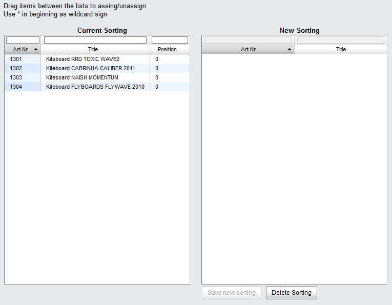
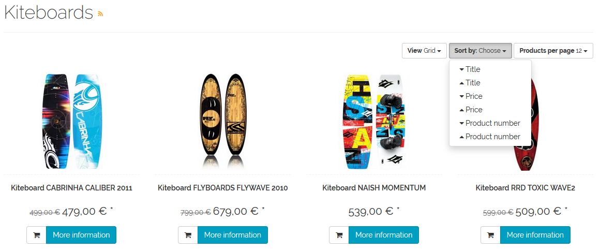

Sorting products
=======================
You can define the order in which products are displayed in a category by using the fast sorting feature - based on a single product characteristic (ascending or descending) - and the manual sorting feature. In addition, you can allow the customers of your OXID eShop to sort the products of a category according to the predetermined criteria.

Fast sorting is based on a certain category setting. Use the drop-down list to select a product characteristic, such as :guilabel:`Title`, :guilabel:`Price` or :guilabel:`Created on`. You will also need to specify whether the products should be sorted in the ascending or descending order according to this characteristic.

* Go to :menuselection:`Administer Products --> Categories`.
* Select the desired category from the category list.
* Open the :guilabel:`Fast Sorting` drop-down list in the :guilabel:`Main` tab.
* Select a product characteristic for fast sorting.
* Select :guilabel:`asc` or :guilabel:`desc` for the ascending or descending order.
* Save the settings.

Manual sorting allows you to arrange the products of a category in a certain way.

* Go to :menuselection:`Administer Products --> Categories`.
* Select the desired category from the category list.
* Click on :guilabel:`Sort Categories` in the :guilabel:`Sorting` tab.
* Drag and drop all the products into the right-hand list of the assignment window.
* Change the order of the products as needed.
* Save the new order.

The current sort order will be displayed in the left-hand list. Product values that are relevant for sorting will be displayed in the “Position” column.

One of the settings in the master data allows you to specify whether your customers can use the sorting feature in categories and what fields they can sort by.

* Go to :menuselection:`Master Settings --> Core Settings`.
* Open the :guilabel:`Settings` tab and select the :guilabel:`Products` section.
* Check the :guilabel:`Users can sort Product Lists` box.
* Define the fields for sorting.
* Save the settings.

The fields by which products can be sorted correspond to the database fields of the *oxarticles* table. Each field must be in a separate line.

The screenshot in the example shows that besides the name and the price, products can also be sorted by the product number. For this purpose, the *oxartnum* field was added to the standard *oxtitle* and *oxvarprice* fields.

.. seealso:: :doc:`Categories - Main tab <../categories/main-tab>` | :doc:`Categories - Sorting tab <../categories/sorting-tab>`

.. Intern: oxbafq, Status: