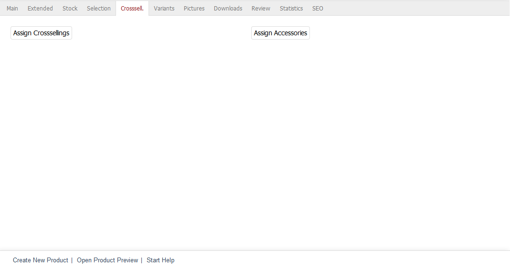
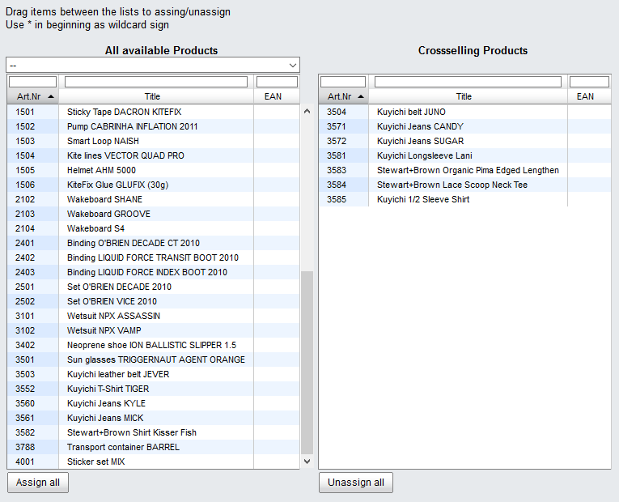
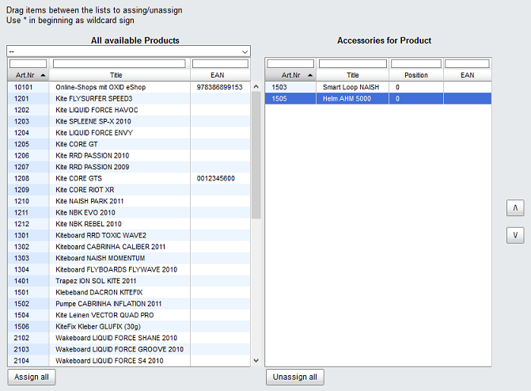

Crosssell. tab
==============

Cross-selling allows you to offer related products and/or product accessories to your customers. Products can be assigned in the :guilabel:`Crosssell.` tab.

Cross-selling is about offering and selling products that work well together and complement each other. For example, you can offer the corresponding (rechargeable) batteries for an MP3 player, the respective drinks for glasses, and vice versa. The assigned products are displayed in an additional \"Have you seen?\" product box on the right side of the product’s detailed view. The title, the picture of the size icon and the price inform the customers about the assigned products that are linked as well.

The number of products displayed in the product box can be specified in :menuselection:`Master Settings --> Core Settings`, the :guilabel:`Settings` tab, under :guilabel:`Products`. The same applies to the accessories. If you want the products to display the product, to which they were assigned, in their detailed view, you will need to enable bidirectional cross-selling. This setting can be found in :menuselection:`Master Settings --> Core Settings`, the :guilabel:`Settings` tab, under :guilabel:`Other settings`.

Assigning products as accessories takes place in a less flexible way. The assigned product will be displayed in the \"Accessories\" section on the right side of the detailed view. There is no bidirectional display for accessories.

.. hint:: You can also add a gift to the shopping cart when the customers purchase a product. To do this, open the :guilabel:`Extended` tab of the product for which you want to offer a free add-on. Click on :guilabel:`Bundled Product` to assign the free product. This function is available only for Community and Professional Edition.

Click on :guilabel:`Assign Crosssellings` to link products for cross-selling. This opens an assignment window where you can select products from the :guilabel:`All available Products` list. Select a category from the drop-down list if you only want to display products from this category. You can also filter products by product number, title and/or EAN. Drag the desired products into the right-hand list using the mouse to complete the assignment.

Clicking on :guilabel:`Assign Accessories` opens the second assignment window. Here too, all products will be displayed in the left-hand list and can be filtered as described. They can be dragged and dropped into the right-hand list and assigned as accessories. Hold down the Ctrl key to select multiple accessories.

The order of the assigned products can be easily changed. Once an item has been highlighted in the right list, it can be moved up or down using the mini buttons that are now displayed.

.. Intern: oxbacn, Status:, F1: article_crossselling.html, transL