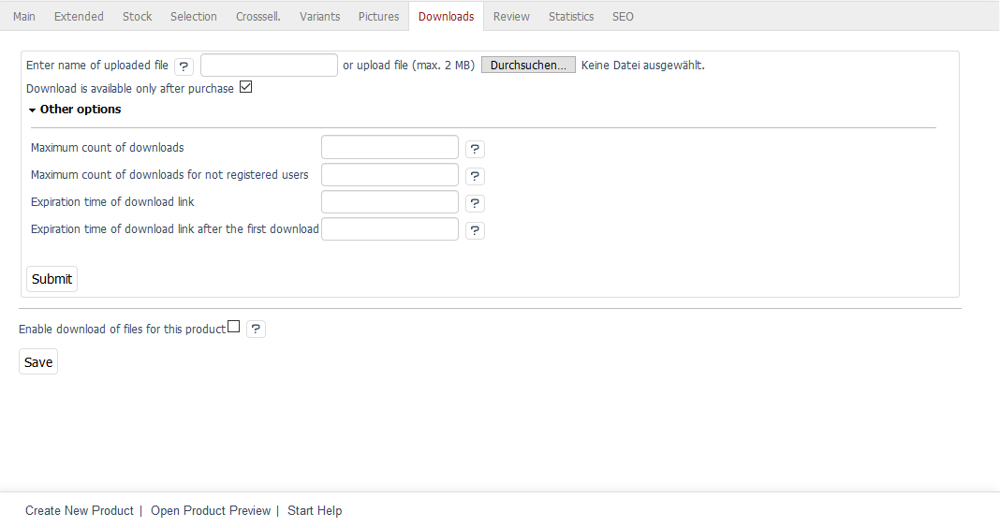
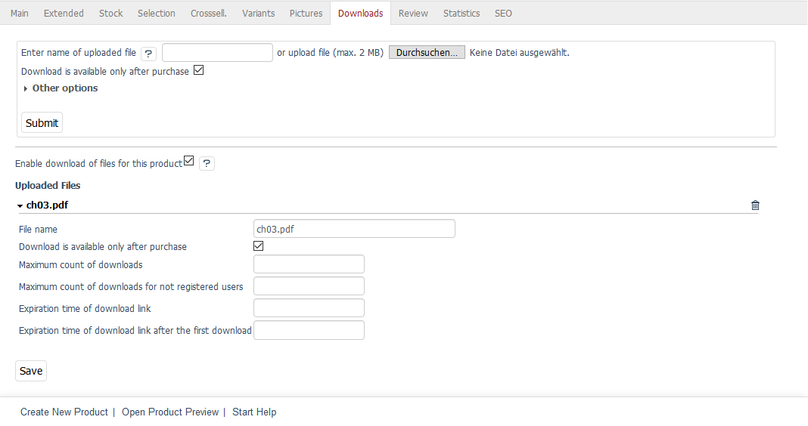

Downloads tab
=======================
With OXID eShop 4.6.0, we have introduced a new product type: the downloadable product. This allows you to offer any files, such as software, photos, music files or document templates, to your customers. When the customer places a downloadable product in the shopping cart, he/she will receive all the associated files.

After ordering, the download links can be found under :menuselection:`Account --> My downloads`. The files can be downloaded once the payment has been made. If the customer used direct debit or credit card as a payment method, he/she will be able to download the files immediately. The order confirmation email will also contain the download links to the ordered files when the payment is complete.

The use of downloadable products in the shop must be enabled globally. To do this, you will need to configure the default settings in :menuselection:`Master Settings --> Core Settings`, the :guilabel:`Settings` tab, under :guilabel:`Downloadable products`, in the Admin panel. In addition to enabling downloadable products, you will be able to set the path to the downloadable files, the count of downloads or expiration times for the download links.

You can use the :guilabel:` Downloads` tab to upload the files relevant for the product and to define their download settings. You can also change the default settings for each downloadable product and for each individual file to further define the download requirements.

:guilabel:`Enter name of uploaded file ... or upload file (max. 2 MB)` |br|
This is where you can add files to the product. One option is to upload them to the web server via FTP. Since the path has already been defined in the default settings, you can just enter the file name. The other option is to upload the files here. Clicking on :guilabel:`Browse...` opens a file dialog where you can select the relevant file on your computer. Click on :guilabel:`Open` to have the path and file name loaded directly.

Click on :guilabel:`Submit` to start the upload. The files will be listed under :guilabel:`Uploaded files` at the bottom of the input area.

.. hint:: When uploading files to the web server via FTP, please follow the instructions in the text file from the :file:`/out/downloads` directory.

:guilabel:`Download is available only after purchase` |br|
Check this box to allow downloading only when payment is complete. Go to :menuselection:`Administer Orders --> Orders` to set the order to Paid in the :guilabel:`Main` tab. Click on :guilabel:`Send` to send the ordered download links to the customer. From this moment on, the downloads will be enabled in :guilabel:`My downloads` in the customer’s account.

:guilabel:`Other options` |br|
You can specify different values from the global settings for the file that is to be uploaded. This overwrites the default settings configured for all products in :menuselection:`Master Settings --> Core Settings`, :guilabel:`Settings` tab under :guilabel:`Downloads`. Without default values, the file will have an unlimited number of downloads and no time limit on the download links.

:guilabel:`Maximum count of downloads` |br|
Specify how often users can use the download link after placing an order.

:guilabel:`Maximum count of downloads for not registered users` |br|
Specify how often users can use the download link after placing an order without registration.

:guilabel:`Expiration time of download link` |br|
Enter the time in hours during which the download link will be valid after placing an order.

:guilabel:`Expiration time of download link after the first download` |br|
Enter the time in hours during which the download link will be valid after the first download.

:guilabel:`Enable download of files for this product` |br|
Check this box to allow the customers to download the files for this product. Otherwise, the product will behave like a regular product and all uploaded files will be disabled.

:guilabel:`Uploaded files` |br|
This area will only be displayed after the first file has been uploaded. It provides a list of all uploaded files with their file name. You can click on it to display the settings for downloading the file that can be changed at any time. To delete the files, click on the small trash icon at the end of the line and confirm that you want to delete them in a confirmation prompt.

.. Intern: oxbacq, Status:, F1: article_files.html