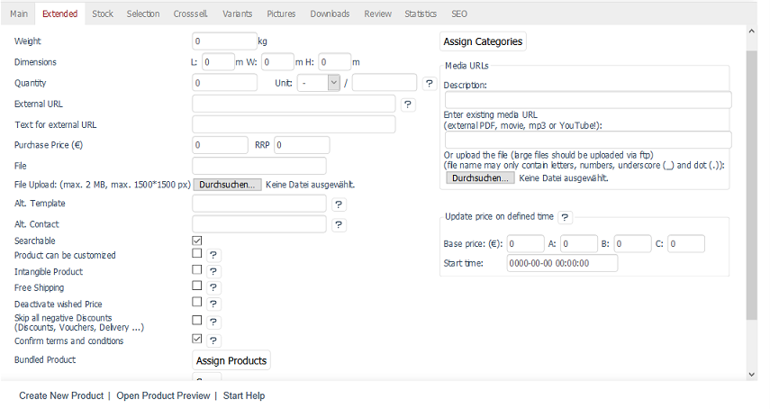
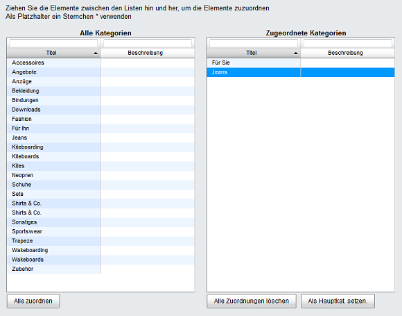

Extended tab
=======================
The :guilabel:`Extended` tab allows you to set specific product characteristics and add sources of information, such as documents, videos, or audio files.

:guilabel:`Weight` |br|
Weight entered here is taken into account in the calculation of shipping costs. It’s measured in kilograms.

:guilabel:`Dimensions L:` ... :guilabel:`m W:` ... :guilabel:`m H:` ... :guilabel:`m` |br|
Enter product’s length, width and height in meters if the shipping costs must be calculated based on product dimensions.

:guilabel:`Quantity` ... :guilabel:`Unit` |br|
Specifying quantity and unit of measure is required for products for which a base price must be specified. The base price is the price relative to a specific unit of measure, such as kilograms or litres. Enter the product quantity per unit of measure. You can select a unit of measure from the list or enter a unit of measure that’s not in the list.

The base price will be displayed in the product’s detailed view.

Example: For a product that is offered in a 1.5 kg package, enter 1.5 in the Quantity field and select :guilabel:`kg` as the unit of measure. Assuming the product costs €3.00, the base price would be €2.00/kg.

:guilabel:`External URL` |br|
Link to an external website, such as the manufacturer's website, with additional information about the product.

:guilabel:`Text for external URL` |br|
If you have added a link to an external website, you will need to enter the text for the link here. This text will be displayed in the product’s detailed view, together with the link to the external URL, at the end of the description.

:guilabel:`Purchase Price (€)` ... :guilabel:`RRP` ... |br|
Enter the product’s purchase price here. It won’t be displayed in the shop but can be useful for future analyses.

RRP (Recommended Retail Price) allows you to offer products at a lower price than the manufacturer recommends. If the RRP, i.e., the price specified by the manufacturer, is greater than the product price, the normal price indication in the detailed view of the article is supplemented by a \"Statt\" with a crossed out RRP.

:guilabel:`File` |br|
After you upload a file, the file name will be displayed here. Deleting the file name and then saving will remove this file from the product’s detailed view in the :guilabel:`MEDIA` tab.

:guilabel:`File Upload: (max. 2 MB)` |br|
Here, you can upload an additional file for the product, for example, a datasheet or a user manual. After saving, the file name will be displayed in the :guilabel:`File` input field. The file can be downloaded in the :guilabel:`MEDIA` tab in the product’s detailed view. Use the :guilabel:`Media URLs` field to add multiple files and a description instead of just the file name.

:guilabel:`Alt. Template` |br|
You can change the product’s detailed view to present it differently from the other products in the shop. To do this, you will need to use a specially created template whose path and name can be entered here. The path is relative to the template directory of the theme used.

Example: The page/details/mydetails.tpl entry for the \"Flow\" theme would call the :file:`mydetails.tpl` template from the :file:`/application/views/flow/tpl/page/details` directory.

:guilabel:`Alt. Contact` |br|
By default, questions that customers can send via email through the product’s detailed view are sent to the email address specified under :menuselection:`Master Settings --> Core Settings`. If you have a direct contact person for a specific product, you will need to enter his/her email address here. All product-related enquiries will be sent directly to this employee.

:guilabel:`Searchable` |br|
This checkbox is selected by default so that customers can search for products in the shop. However, sometimes you might not want them to be able to search for a certain product in the shop, for example, if this is a free product that is added when they purchase something else. This needs to be done to prevent them from adding this product to the shopping cart multiple times.

:guilabel:`Product can be customized` |br|
If this box is checked, an additional input field will be displayed on the product’s details page and in the shopping cart. Customers can enter text in this input field to provide individual information when purchasing products. This could be the text that is printed on a T-shirt or a mug or an engraved in a ring.

:guilabel:`Intangible Product` |br|
Intangible products are products that are not packaged and sent to customers, for example, seminars or services. If no shipping costs have to be calculated for all intangible products, you will need to select :guilabel:`Don't consider intangible Products (e.g. Gift Certificates) in Shipping Costs Calculation` in :menuselection:`Master Settings --> Core Settings`, the :guilabel:`Settings` tab, under :guilabel:`Other settings`.

If you want to offer software, please use the \"Downloadable product\" function.

:guilabel:`Free Shipping` |br|
If this box is checked, the product won’t be included in the shipping cost calculation. However, even when this product is added to the shopping cart together with other products, this doesn’t mean that the entire order will ship for free.

:guilabel:`Deactivate Price Alert` |br|
Customers can use the price alert in the product’s detailed view by entering a price at which they would buy the product.

Customer enquiries are collected under :menuselection:`Customer Info --> Price Alert` in the Admin panel. The shop owner can notify the customer by email, prepared by the shop, once the desired price has been reached. Use this field to turn off the price alert function for a specific product.

:guilabel:`Skip all negative Discounts (Discounts, Vouchers, Delivery ...)` |br|
If this box is checked, no negative discounts, such as discounts and coupons, will be calculated for this product.

:guilabel:`Confirm terms and conditions` |br|
According to the EU Consumer Rights Directive, which came into force on 13 June 2014, the user must agree to waive the right of withdrawal for services (intangible products) and downloadable products. For this purpose, a check box that hasn’t been preselected will be displayed with a corresponding message in the fourth step of the ordering process. In general, this function must be activated under :guilabel:`Order` in the :guilabel:`Settings` tab, under :menuselection:`Master Settings --> Core Settings`.

:guilabel:`Bundled Product` |br|
Use this button to assign a free product to the selected product. It will be added to the shopping cart when customers purchase the product.

.. hint:: This function is currently available only for Community and Professional Edition.

:guilabel:`In Language` |br|
The product can also be edited in other active languages of the shop. To do this, select the desired language from the list.

:guilabel:`Assign Categories` |br|
A product can belong to one or more categories. Clicking on :guilabel:`Assign Categories` opens a new window.

All available categories will be displayed in the left-hand list. Drag and drop the desired categories into the right-hand list of the assignment window. Hold down the Ctrl key to select multiple categories. The assignment is now completed. If the product exists in multiple categories, one of them must be set as the main category to avoid duplicate content (DC). Highlight the main category in the right-hand list and click on :guilabel:`Set as Main Category`.

:guilabel:`Media URLs` |br|
You can provide additional information, such as links or downloads, in the product’s detailed view. These will be displayed in the automatically created :guilabel:`MEDIA` tab. You can also add multiple media files for a product.

:guilabel:`Media URLs` - :guilabel:`Description` |br|
Enter the description for the media file.

:guilabel:`Media URLs` - :guilabel:`Enter existing media URL (external PDF, movie, mp3 or YouTube!)` |br|
Enter the URL to access the media file.

:guilabel:`Media URLs` - :guilabel:`Or upload the file (large files should be uploaded via ftp) (file name may only contain letters, numbers, underscore (_) and dot (.))` |br|
Upload a file that will be available for download to the customer in the :guilabel:`MEDIA` tab of the product’s detailed view.

:guilabel:`Update price at defined time` |br|
The prices of a product can be changed at a set time. You can set the date and time when the defined default prices should be updated.

:guilabel:`Update price at defined time` - :guilabel:`Base price (€)` ... :guilabel:`A` ... :guilabel:`B` ... :guilabel:`C` ... |br|
Enter the prices that should replace the previously set prices. If a price is set at \"0\", it won’t be updated.

:guilabel:`Update price on defined time` - :guilabel:`Start time` |br|
Set the time for the price update.

.. seealso:: :doc:`Categories <../categories/categories>` | :doc:`Assigning products to categories <../products-and-categories/assigning-products-to-categories>` | :doc:`Product’s main category <../products-and-categories/main-category-of-a-product>` | :doc:`Price per unit (base price) <../products-and-categories/price-per-unit-base-price>` | :doc:`Add-on product <../../operation/discounts/product-as-add-on>`

.. Intern: oxbacj, Status:, F1: article_extend.html