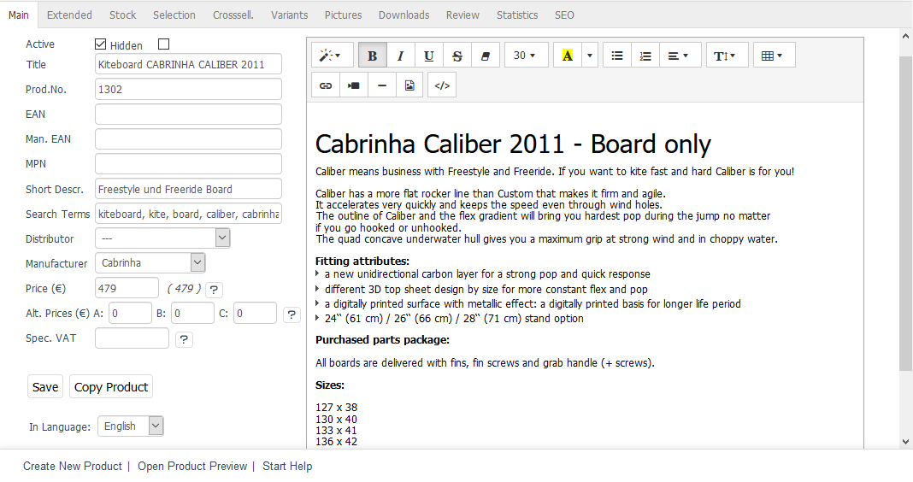

Main tab
========

The :guilabel:`Main` tab contains important information about the product. This is where you can create or edit a product. When you create a product, you can assign it to a category directly. To do this, use the :guilabel:`In Category` drop-down list at the bottom of the input area. After saving the product, the quick assignment to a category in this tab will no longer be possible.

Use the language drop-down list displayed in the input area after creating a product to edit the information and settings for the product directly in another language.

:guilabel:`Active` |br|
Check this box to have the product displayed in the shop. If the product hasn’t been activated, it will be saved in the database but won’t be displayed in the shop.

:guilabel:`Hidden` |br|
If this box is checked, the product won’t be displayed in the shop front end but can still be accessed with a direct link. This way, you can find the product in the shop even if it is currently or no longer available but the link is still listed in the search engines.

:guilabel:`Or active from` ... :guilabel:`to` ... |br|
You can define a time period when a product will be active. This allows you, for example, to use an offer that will only be valid for a certain period of time. The start and end must be specified in the YYYY-MM-DD HH:MM:SS format. Date and time of the end of activation are mandatory. If you just want to activate a product from a certain date, simply enter an end time far in the future.

.. hint:: In order for this setting to be visible in the tab, you will need to select :guilabel:`Check \"Active From/To\" when loading Products` under :menuselection:`Master Settings --> Core Settings`, the :guilabel:`Perform.` tab. In addition, the :guilabel:`Active` box for the product must not be checked.

:guilabel:`Title` |br|
The product will be displayed with this title in the shop. Make sure to use concise product titles with accurate information. This is informative for the shop visitors and equally interesting for search engines.

:guilabel:`Prod.No.` |br|
Make sure to use a unique number for the product. It will be displayed to the customer in the product’s detailed view in the shop. It can also be used to search for products. There are no requirements for the structure of the product number as it depends on the number of products as well as on whether the product number is specified by a merchandise management system.

:guilabel:`EAN` |br|
Unique product identifier that can be entered here. In Europe this is the `European Article Number (EAN) <https://en.wikipedia.org/wiki/International_Article_Number>`_ . In the United States this is the `Universal Product Code (UPC) <https://en.wikipedia.org/wiki/Universal_Product_Code>`_ and in Japan the Japanese Article Number (JAN). This field can also contain the `International Standard Book Number (ISBN) <https://en.wikipedia.org/wiki/International_Standard_Book_Number>`_ .

:guilabel:`Man. EAN` |br|
Additional field for further categorisation of the product, for example, the manufacturer's EAN identification (numbers 4 to 7 of the barcode).

:guilabel:`Manufacturer’s part number (MPN)` |br|
MPN (Manufacturer's Part Number). Number that uniquely assigns the product to a manufacturer.

:guilabel:`Short Descr.` |br|
Describe the product in a few words. The short description is displayed in the product’s detailed view together with the title, product number, price and product image. This information characterises the product and the customer can see it at a glance.

:guilabel:`Search Terms` |br|
Enter terms that can be used to search for the product in the shop. Make sure to add the words that appear in the product title and description and use generalisations. This allows customers to find products in the shop when they search for a term that is neither in the title nor in the description of a product. Make sure to separate multiple search terms with space or comma.

:guilabel:`Distributor` |br|
Select the product’s distributor. Distributors can be created and edited under :menuselection:`Master Settings --> Distributors`.

:guilabel:`Manufacturer` |br|
Select the product’s manufacturer from the list. Manufacturers can be created and edited under :menuselection:`Master Settings --> Brands/Manufacturers`.

:guilabel:`Price (€)` |br|
Enter the product’s selling price. The gross price will be displayed by default. The price will be inherited by the product’s variants if no separate price has been set for them.

You can also change the price entry to net. This setting can be found in :menuselection:`Master Settings --> Core Settings`, the :guilabel:`Settings` tab, under :guilabel:`Other settings`. In general, it applies to all products. The actual selling price is always displayed in brackets next to the price entry field. If there is a discount for a product, its discounted price will be displayed as well.

:guilabel:`Alt. Prices (€)` |br|
You can use the three fields to enter alternative prices that are directly linked to the \"Price A\", \"Price B\" and \"Price C\" user groups. This allows you to set up and display your own prices instead of the regular price for certain customers.

:guilabel:`Spec. VAT` |br|
If products require a VAT rate that is different from the shop’s default rate, it can be entered here. The VAT rate that is used in the shop by default can be specified in :menuselection:`Master Settings --> Core Settings`, the :guilabel:`Settings` tab, under :guilabel:`VAT`.

:guilabel:`In Language` |br|
The product can also be edited in other active languages of the shop. To do this, select the desired language from the list.

Product’s long description
-----------------------------
Product’s long description can be entered in an editor on the right side of the :guilabel:`Main` tab. This works based on the WYSIWYG (What You See Is What You Get) principle, which means that the text is displayed the way it will be visible later as the description in the product’s detailed view. The editor lets you use different text formatting options and insert links, pictures and videos. It also allows you to display and edit the HTML code to meet any special or additional requirements.

.. seealso:: :doc:`Alternative prices for user groups <../products-and-categories/alternative-prices-for-user-groups>` | :doc:`Manufacturers <../manufacturer/manufacturers>` | :doc:`Distributors <../distributors/distributors>`

.. Intern: oxbaci, Status:, F1: article_main.html