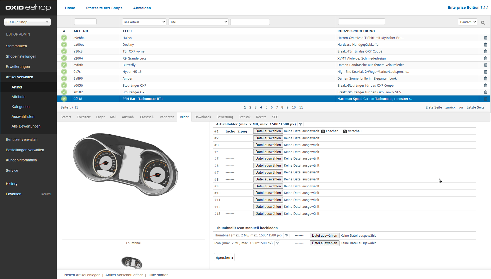

Picture tab
====================
Products can have up to twelve images that are very important for their optimal presentation in the shop. Images should display the product in different views and from different angles. Product images are displayed in the product’s detailed view. In addition, there are zoom images that are also available on the product’s details page. Smaller product images - thumbnails und icons - show the product in product lists, product boxes and in the shopping cart. Product default size can be defined in the theme settings. A detailed description can be found under :doc:`Images <../../configuration/images>` in the \"Configuration\" section.

The :guilabel:`Pictures` tab allows you to load seven product images onto the web server. However, by looking at the directory structure, you can see that you can actually load up to 12 product images. To do this, you will need to either download additional product images to the web server via FTP or customise the template for the Admin panel for the larger number of uploads. Information on working with images and the directory structure of product images starting with OXID eShop 4.5.1 and later versions can be found in the English-language tutorial `Image handling changes <https://oxidforge.org/en/image-handling-changes-since-version-4-5-1.html>`_ on the OXIDforge page.

Once the first product image has been uploaded, the generated thumbnail and icon will be displayed on the left side of the tab. You can preview the product images. Those that are no longer required can be deleted. This will not only remove the product images from the tab but also delete them from the web server.

:guilabel:`Product pictures (max. 2 MB, max. 1500*1500 px)` |br|
Uploading product images is subject to file size restrictions. By default, the images should be no more than 2 MB in size or have a maximum resolution of 1500*1500 pixels. If you allow larger images to be uploaded, PHP memory limit issues may occur when generating the various product images. The upload_max_filesize and memory_limit parameters in the :file:`php.ini` configuration file are important for uploading and generating product images.

:guilabel:`#1` - :guilabel:`#7` |br|
You can upload a maximum of seven product images to the web server. Clicking on :guilabel:`Browse...` opens a file dialog where you can select the relevant file on your computer. Click on :guilabel:`Open` to have the path and file name loaded directly. Clicking on “Save” starts uploading the product image after which the file name will be displayed, e.g., in field :guilabel:`#1`. The thumbnail and the icon will be created at the same time.

:guilabel:`Custom pictures` |br|
Instead of the automatically generated thumbnail and/or icon, you can use a different image for these product views.

:guilabel:`Thumbnail (max. 2 MB, max. 1500*1500 px)` |br|
Upload the thumbnail you want to use instead of the thumbnail generated when uploading the first product image. This overwrites the automatically generated thumbnail and displays the new one as a preview on the left side.

:guilabel:`Icon (max. 2 MB, max. 1500*1500 px)` |br|
Upload the special product image you want to use as the icon. The automatically generated icon will be overwritten. The new icon will be displayed in the preview on the left side of the tab.

.. Intern: oxbacp, Status:, F1: article_pictures.html