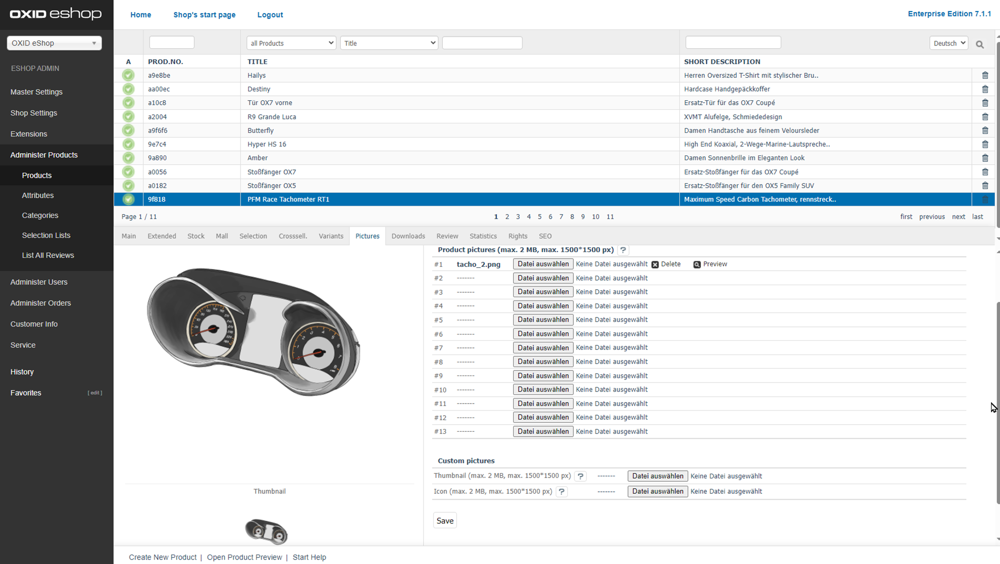

Pictures tab
============

Manage product images directly via the :guilabel:`Pictures` tab.

Present your products in an appealing way by uploading up to twelve images showing different views and angles. These images appear in the product’s detailed view. Additional zoom images are also available. Smaller versions — thumbnails and icons — are used in product lists, product boxes, and the shopping cart.

Define the standard image dimensions in the theme settings. For detailed instructions, see the “Configuration” section under :doc:`Images <../../configuration/images>`.

   Fig.: Products – Pictures tab

|procedure|

1. In the Admin panel, open the desired product detail page.
#. Switch to the :guilabel:`Pictures` tab.
#. Upload up to seven product images directly using the interface. To use more than seven images, either upload them via FTP or customise the Admin panel template.

   :guilabel:`Product pictures (max. 2 MB, max. 1500 × 1500 px)`
      When uploading, follow the standard limits: max. 2 MB per file and max. 1500 × 1500 pixels. Exceeding these values may cause memory issues during thumbnail or icon generation. If needed, adjust the parameters ``upload_max_filesize`` and ``memory_limit`` in the :file:`php.ini` file.

   :guilabel:`#1` – :guilabel:`#7`
      Use fields :guilabel:`#1` to :guilabel:`#7` to select images from your local system. Click :guilabel:`Browse...`, choose an image, then confirm with :guilabel:`Open`. Click :guilabel:`Save` to upload the image. The system will automatically generate a thumbnail and an icon.

   :guilabel:`Custom pictures`
      Overwrite the automatically generated thumbnail or icon with your own files. The custom images will be shown in the preview on the left side.

   :guilabel:`Thumbnail (max. 2 MB, max. 1500 × 1500 px)`
      Upload an alternative thumbnail here if the one generated automatically does not meet your requirements.

   :guilabel:`Icon (max. 2 MB, max. 1500 × 1500 px)`
      Upload a specific icon image to replace the automatically created one.

#. Use the preview feature to verify the uploaded images.
#. To remove an image, click the trash icon. The system will delete the image from both the tab and the web server.

|result|

After saving, the product detail view displays the uploaded image, the product list shows the corresponding thumbnail, and the shopping cart shows the icon.

.. seealso:: :doc:`Products – Extended tab <../products/extended-tab>` | :doc:`Images <../../configuration/images>`

.. Intern: oxbacp, Status:, F1: article_pictures.html
