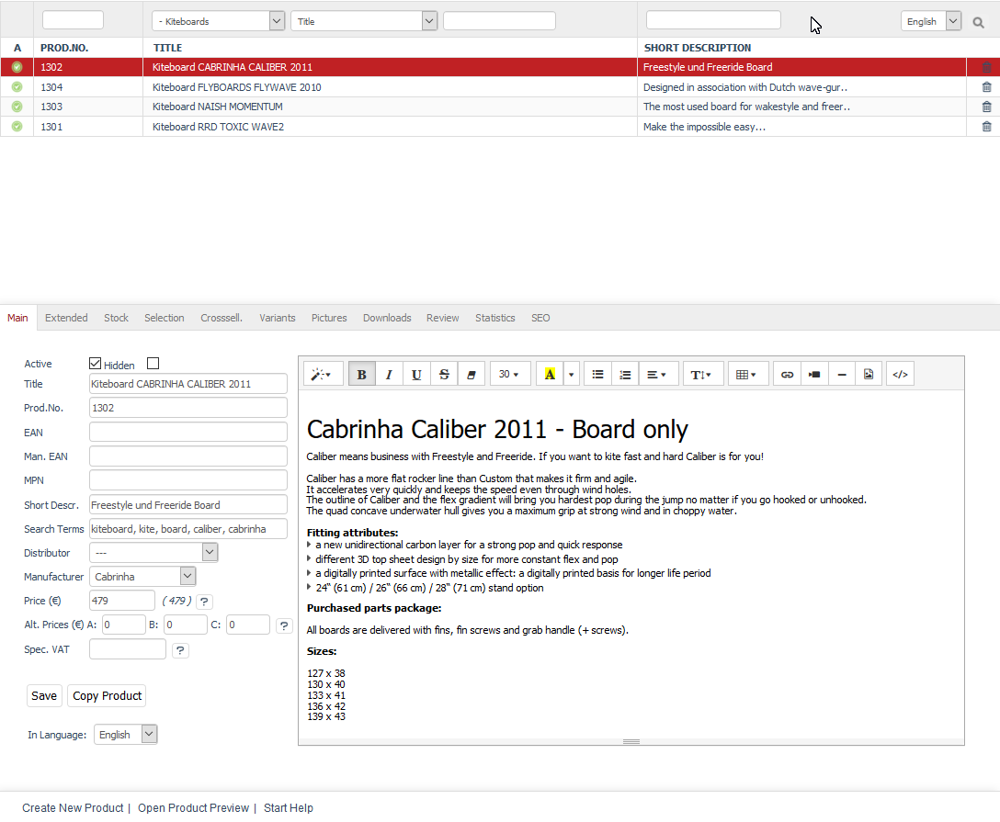

Products
=======
Besides categories, products are the very basis of the product catalogue. After all, an online shop is all about presenting and selling the products. Titles and short or long descriptions are the most important product characteristics, but there are many more that allow products to be described in detail. There are also product images that should display the product in different views and from different angles. High-quality photos are important to present the product in the best way possible and can be decisive for the purchase.

   
The \"Products\" section tells you how to create and manage products. It explains all the settings that can be configured for the products. The section also discusses attributes and selection lists as well as variants and multidimensional variants.

Products can be edited in the Admin panel under :menuselection:`Administer Products --> Products`. Here, you will see the product list and the input area right below it.

A small green icon at the beginning of the line in the product list symbolises an active product. It is not displayed for inactive products. The product list shows the number, the title and the short description of the product. You can search for products by using search fields and/or filters for categories and product characteristics. For example, if you enter the number 13 the “Prod.No.” search field, you will see all the products listed with 13 in the product number. In the demo data, these are the kiteboards with the product numbers 1301, 1302, 1303 and 1304.

Products can be permanently removed from the database by clicking on the trash icon at the end of the line. If you just want to temporarily remove a product from the shop because it is currently out of stock, you can set it to inactive. The advantage of this is that you don’t have to recreate the product as soon as it is back in stock.

When you select a product from the product list, the product information will be displayed in the input area. To create a new product, click on :guilabel:`Create New Product` at the bottom of the screen.

-----------------------------------------------------------------------------------------

Main tab
-------------------
**Contents**: active product, title, product number, EAN, MPN, short and long description, search terms, distributor and manufacturer, price and alternative price, special VAT |br|
:doc:`Read article <main-tab>` |link|

Extended tab
-----------------------
**Contents**: weight, dimensions, quantity, basic price, external URL, purchase price, RRP, alternative template, searchable and customisable, intangible product (service), free shipping, EU Consumer Rights Directive 2013, waiving the right of withdrawal for intangible and downloadable products, free product, assigning categories, media files as URL or for download, updating prices |br| 
:doc:`Read article <extended-tab>` |link|

Stock tab
-------------------
**Contents**: stock, external storehouse, product sold out, offline or not orderable, delivery time, product back in stock, product in stock, product out of stock, email about stock, messages about stock, scale prices, quantity, quantity discount |br|
:doc:`Read article <stock-tab>` |link|

Mall tab
------------------
Available only in Enterprise Edition |br|
**Contents**: inheriting products, assigning products, parent shop, subshop, supershop, multishop, Mall |br|
:doc:`Read article <mall-tab>` |link|

Selection tab
---------------------
**Contents**: assigning attributes, specific characteristics, assigning selection lists, typical versions, reusable for many products |br|
:doc:`Read article <selection-tab>` |link|

Crosssell. tab
------------------------
**Contents**: cross-selling, Crossselling, Have you seen?, bidirectional cross-selling, accessories |br|
:doc:`Read article <crosssell-tab>` |link|

Variants tab
-----------------------
**Contents**: variants, multidimensional variants, product versions, parent product, purchasable, inheritance, selection name and value, variants from selection lists |br|
:doc:`Read article <variants-tab>` |link|

Picture tab
--------------------
**Contents**: product images, thumbnail, icon, zoom image, upload, upload to web server, automatically generated |br|
:doc:`Read article <picture-tab>` |link|

Downloads tab
-----------------------
**Contents**: downloadable products, download links, my downloads, download count, expiration time of download links, uploaded files |br|
:doc:`Read article <downloads-tab>` |link|

Review tab
-----------------------
**Contents**: product reviews, stars and comments, moderating product reviews |br|
:doc:`Read article <review-tab>` |link|

Statistics tab
-----------------------
**Contents**: creation date, modification date, sales rank, orders, sales, cancellations |br|
:doc:`Read article <statistics-tab>` |link|

Rights tab
--------------------
Available only in Enterprise Edition |br|
**Contents**: visible products, buyable products, assigning user groups, exclusive rights, rights and roles, shop permissions (front end) |br|
:doc:`Read article <rights-tab>` |link|

SEO tab
-----------------
**Contents**: search engine optimisation, SEO, selecting URL, fixed URL, SEO URL, meta tags, keywords, meta name=\"keywords\", description, meta name=\"description\" |br|
:doc:`Read article <seo-tab>` |link|

.. seealso:: :doc:`Attributes <../attributes/attributes>` | :doc:`Selection lists <../selection-lists/selection-lists>` | :doc:`Categories <../categories/categories>` | :doc:`Products and categories <../products-and-categories/products-and-categories>` | :doc:`Manufacturers <../manufacturer/manufacturers>` | :doc:`Distributors <../distributors/distributors>`

.. Intern: oxbach, Status: