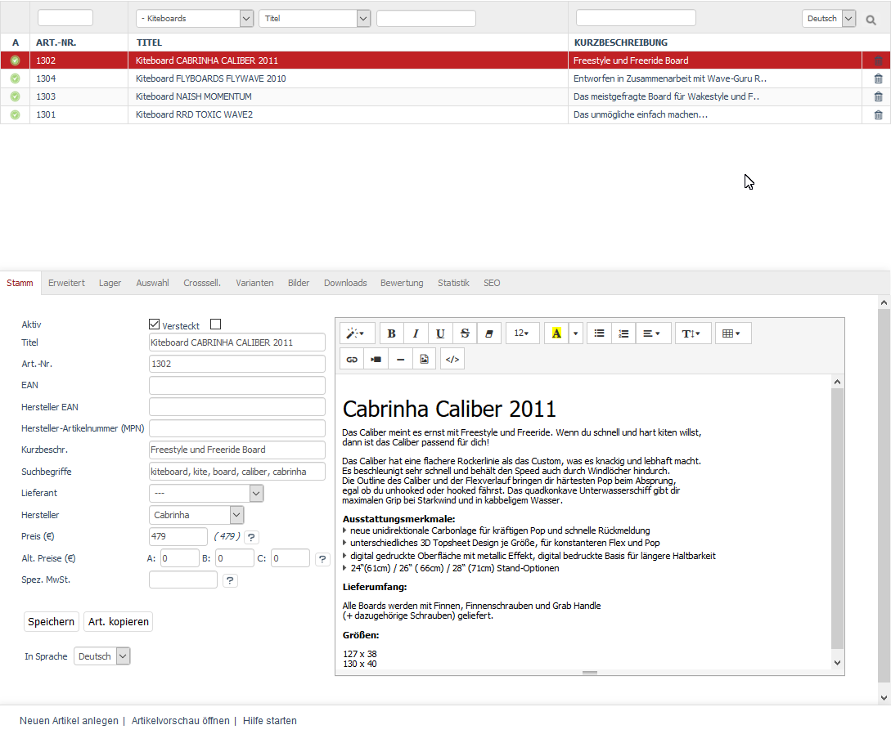

Products
========

Besides categories, products are the core of your product catalogue. After all, the goal of an online shop is to present and sell products effectively.

Assign a clear title and provide both short and long descriptions to highlight key product details. Add more attributes to describe your products precisely — such as dimensions, weight, or manufacturer data.

Upload high-quality product images showing the item from different angles. Good product photos help showcase the product and can influence the buying decision.

   Fig.: Managing Products

Use the **Products** section to learn how to create and manage products. This section explains all available configuration options and covers topics such as attributes, selection lists, variants, and multidimensional variants.

Manage products in the Admin panel under :menuselection:`Administer Products --> Products`. You will see the product list at the top and the input area below it.

In the product list, a small green circle with a check mark at the beginning of the line indicates that the product is active. This symbol is missing for inactive products. The list displays the product number, title, and short description.

Use the search fields or filters (e.g., category, product number, or attributes) to find specific products. For example, enter “13” in the :guilabel:`Prod.No.` field to see all products containing “13” in the product number.

Sort the product list by clicking the column headers — such as Active, Product Number, Title, or Short Description. The system will display products in ascending order.

To permanently delete a product from the database, click the trash icon at the end of the line. To temporarily remove a product from the shop (e.g., due to stock unavailability), simply set it to inactive. This way, you can reactivate the product later without re-creating it.

When you select a product in the list, the system loads its data into the input area. To add a new product, click :guilabel:`Create New Product` at the bottom of the screen.

-----------------------------------------------------------------------------------------

Main tab
--------
**Contents**: active product, title, product number, EAN, MPN, short and long description, search terms, distributor and manufacturer, price and alternative price, special VAT |br|
:doc:`Read article <main-tab>` |link|

Extended tab
------------
**Contents**: weight, dimensions, quantity, basic price, external URL, purchase price, RRP, alternative template, searchable and customisable, intangible product (service), free shipping, EU Consumer Rights Directive 2013, waiving the right of withdrawal for intangible and downloadable products, free product, assigning categories, media files as URL or for download, updating prices |br| 
:doc:`Read article <extended-tab>` |link|

Stock tab
---------
**Contents**: stock, external storehouse, product sold out, offline or not orderable, delivery time, product back in stock, product in stock, product out of stock, e-mail about stock, messages about stock, scale prices, quantity, quantity discount |br|
:doc:`Read article <stock-tab>` |link|

Mall tab
--------
Available only in Enterprise Edition |br|
**Contents**: inheriting products, assigning products, parent shop, subshop, supershop, multishop, Mall |br|
:doc:`Read article <mall-tab>` |link|

Selection tab
-------------
**Contents**: assigning attributes, specific characteristics, assigning selection lists, typical versions, reusable for many products |br|
:doc:`Read article <selection-tab>` |link|

Crosssell. tab
--------------
**Contents**: cross-selling, Crossselling, Have you seen?, bidirectional cross-selling, accessories |br|
:doc:`Read article <crosssell-tab>` |link|

Variants tab
------------
**Contents**: variants, multidimensional variants, product versions, parent product, purchasable, inheritance, selection name and value, variants from selection lists |br|
:doc:`Read article <variants-tab>` |link|

Picture tab
-----------
**Contents**: product images, thumbnail, icon, zoom image, upload, upload to web server, automatically generated |br|
:doc:`Read article <pictures-tab>` |link|

Downloads tab
-------------
**Contents**: downloadable products, download links, my downloads, download count, expiration time of download links, uploaded files |br|
:doc:`Read article <downloads-tab>` |link|

Review tab
----------
**Contents**: product reviews, stars and comments, moderating product reviews |br|
:doc:`Read article <review-tab>` |link|

Statistics tab
--------------
**Contents**: creation date, modification date, sales rank, orders, sales, cancellations |br|
:doc:`Read article <statistics-tab>` |link|

Rights tab
----------
Available only in Enterprise Edition |br|
**Contents**: visible products, buyable products, assigning user groups, exclusive rights, rights and roles, shop permissions (front end) |br|
:doc:`Read article <rights-tab>` |link|

SEO tab
-------
**Contents**: search engine optimisation, SEO, selecting URL, fixed URL, SEO URL, meta tags, META Keywords, META Description, meta name=\"keywords\", description, meta name=\"description\" |br|
:doc:`Read article <seo-tab>` |link|

.. seealso:: :doc:`Attributes <../attributes/attributes>` | :doc:`Selection lists <../selection-lists/selection-lists>` | :doc:`Categories <../categories/categories>` | :doc:`Products and categories <../products-and-categories/products-and-categories>` | :doc:`Manufacturers <../manufacturers/manufacturers>` | :doc:`Distributors <../distributors/distributors>`

.. Intern: oxbach, Status: transL