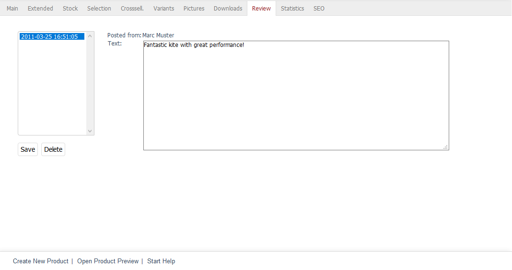
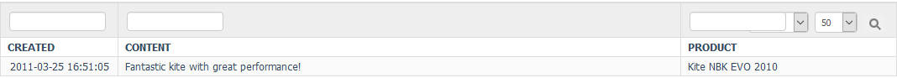

Review tab
==========

Customers can review products in your shop, which ensures transparency and helps build trust. They can go to the product’s detailed view to give it up to five stars and leave a comment. The reviews and the average stars awarded are displayed at the bottom of the detailed view.

This tab allows you to view the reviews for a product, correct small spelling errors and delete a review if necessary.

All reviews are listed under :menuselection:`Administer Products --> Products --> List All Reviews` and are linked directly to the product.

You can decide whether you want to publish a review before it is displayed in the product’s detailed view. To do this, select :guilabel:`Moderate Product Reviews: They are only published after they are activated by an Administrator User` in :menuselection:`Master Settings --> Core Settings`, the :guilabel:`System` tab, under :guilabel:`Other settings`.

Another setting for product reviews can be found in :menuselection:`Master Settings --> Core Settings`, the :guilabel:`Settings` tab, under :guilabel:`Other settings`. Here, you can specify after how many days customers are allowed to post a new review for a product. Without a value, customers are generally only allowed to review a product once.

All reviews are listed with date and time in a selection box. The latest reviews are at the end of the list. When you select an order, the customer’s name and the review text will be displayed on the right. The :guilabel:`Active` checkbox will only be visible if moderating product reviews has been enabled.

You can save changes to the reviews or delete a review. Please make sure to only delete reviews that are not real (spam messages). Don’t delete negative reviews; instead, provide a response. In the long run, it will create trust when customers don’t only see positive reviews.

:guilabel:`Active` |br|
Check this box if you want the review to be displayed in the product’s detailed view.

:guilabel:`Posted from` |br|
First and last name of the customer who submitted the review.

:guilabel:`Text` |br|
Text of the submitted review that can be edited. Click on :guilabel:`Save` to have the changes written to the database.

.. Intern: oxbacr, Status:, F1: article_review.html