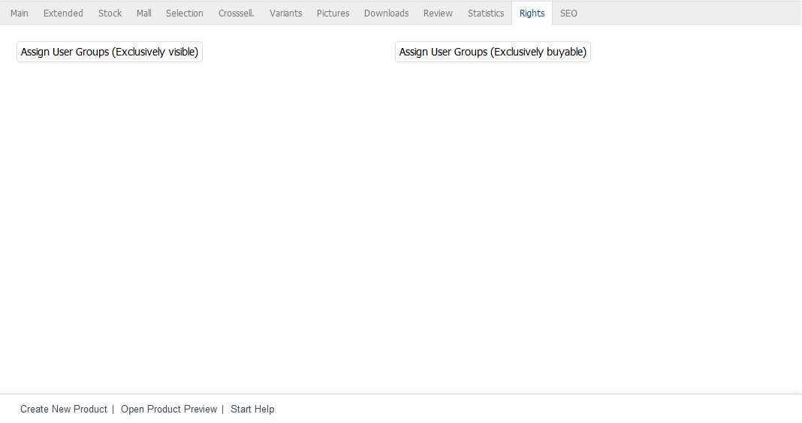
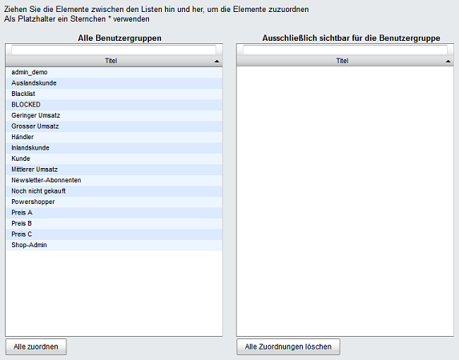

Rights tab
====================
The :guilabel:`Rights` tab is only available for products in Enterprise Edition.

The :guilabel:`Rights` tab allows you to assign user groups whose users are allowed to view and/or buy this product in the shop. This assignment is part of the rights and roles management feature in Enterprise Edition.

On the one hand, the exclusive right means that only users who belong to the assigned user groups will be able to see the product after logging into the shop. All other users and user groups will never be able to see this product. On the other hand, if user groups have been assigned as exclusively buyable, unauthorised users won’t be able to add the product to the shopping cart. By clicking on :guilabel:`More information`, they will only be able to open the product’s details page from the product overview. The :guilabel:`To cart` button won’t be displayed there either unless the customer is logged in to the shop and belongs to the authorised user group.

Click on :guilabel:`Assign User Groups (Exclusively visible)` or :guilabel:`Assign User Groups (Exclusively buyable)` to assign user groups to a product. This opens an assignment window where you can select products from the :guilabel:`All User Groups` list.

User groups can be filtered and sorted by title. Drag the desired user groups from the left-hand list into the right-hand list using the mouse. Hold down the Ctrl key to select multiple user groups. The assignment is now completed.

.. seealso:: :doc:`Rights and roles <../../configuration/rights-and-roles>`

.. Intern: oxbact, Status:, F1: article_rights.html