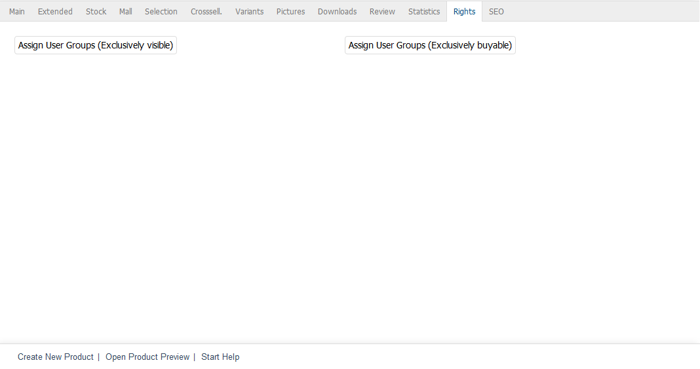

Rights tab
==========

Use the :guilabel:`Rights` tab to control which user groups are allowed to view and/or purchase a product in the shop. This tab is only available in OXID eShop Enterprise Edition.

Assign specific user groups to the product to define access and purchase permissions. This function is part of the Enterprise Edition's rights and roles management system.

.. _oxbact01:

   Fig.: Products – Rights tab

|background|

Exclusive visibility means: Only customers who belong to the assigned user groups will see the product after logging in. The product remains invisible to all other users and groups.

Exclusive purchasing rights go one step further. If the customer is not part of an authorised user group, they won’t be able to place the product in the cart. The button :guilabel:`More information` will still be available to access the product details page. However, the button :guilabel:`To cart` will be missing – even on the product page.

This restriction remains in place until the customer logs in and belongs to a group with appropriate rights. For more information, see :ref:`configuration/rights-and-roles:Restricting Purchase of Articles and Categories`.

|prerequisites|

To assign a user group, you have created it already.

To create new user groups, choose :menuselection:`Administer Users --> User Groups`.

|procedure|

1. Go to :menuselection:`Administer Products --> Products` in the Admin panel.
2. Select the desired product from the product list.
3. Open the :guilabel:`Rights` tab.
4. Click one of the following buttons depending on the type of restriction:

   * :guilabel:`Assign User Groups (Exclusively visible)`
   * :guilabel:`Assign User Groups (Exclusively buyable)`

5. In the assignment window, select the required user groups from the :guilabel:`All User Groups` list.

   .. figure:: ../../media/screenshots/oxbact02.png
      :alt: Assigning User Groups (Exclusively visible)
      :width: 400
      :class: with-shadow

      Fig.: Assigning User Groups (Exclusively visible)

6. Filter or sort the list of groups by title, if necessary.
7. Drag and drop the selected user groups into the right-hand list.

   Hold down the Ctrl key to select multiple groups.
8. Close the window to complete the assignment.

|result|

Once saved, the product becomes visible or buyable only to the assigned user groups – depending on the settings. Other customers will no longer see the product or be able to purchase it.

.. seealso:: :doc:`Rights and roles <../../configuration/rights-and-roles>`

.. Intern: oxbact, Status:, F1: article_rights.html

