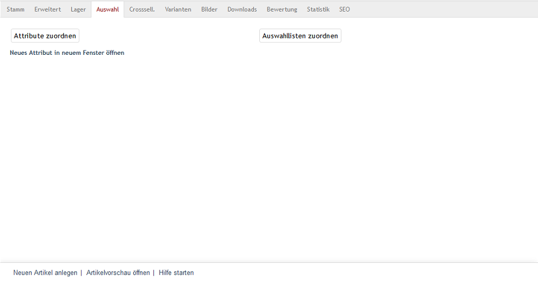
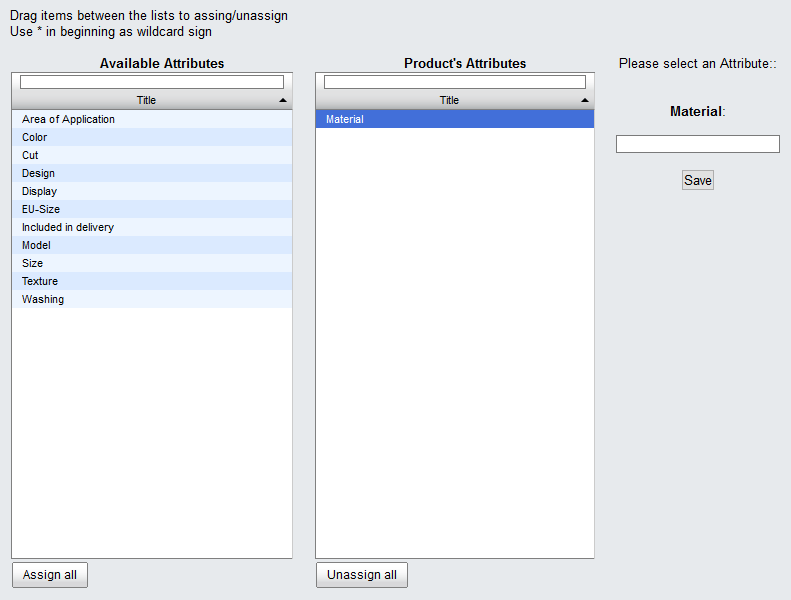
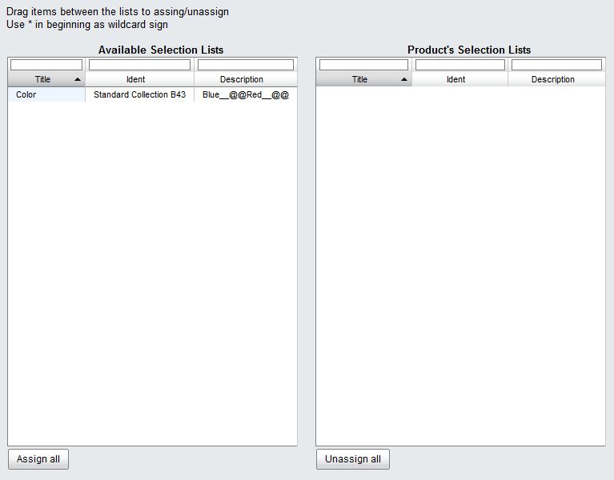

Selection tab
=====================
The :guilabel:`Selection` tab allows you to assign attributes and/or selection lists to a product.

Products can have a lot of characteristics. OXID eShop offers input and setting options for some of them, such as weight or dimensions. These characteristics can be used immediately. If you need additional characteristics, you can create attributes and assign them to your products. This way, a new :guilabel:`SPECIFICATION` tab displaying the attributes and their values will be added to the product’s detailed view.

Selection lists define typical product versions, such as different colours or sizes. These are templates that can be used for many products. Products with a selection list have a drop-down list in the detailed view that the customer can use to select the desired version. The selection, such as the product colour or size, will be saved with the order.

Clicking on :guilabel:`Assign Attributes` opens a new window where you can assign attributes to a product. All unused attributes will be displayed in the left-hand list. The required attributes can be dragged and dropped into the right-hand list. Hold down the Ctrl key to select multiple attributes. After you select an attribute in the right-hand list, you will need to enter and save a value for it.

Clicking on :guilabel:`Assign Selection Lists` opens another assignment window. This displays all available selection lists which can also be dragged and dropped into the right-hand list.

.. seealso:: :doc:`Attributes <../attributes/attributes>` | :doc:`Selection lists <../selection-lists/selection-lists>` | :doc:`Filtering products <../products-and-categories/filtering-products>`

.. Intern: oxbacm, Status:, F1: article_attribute.html