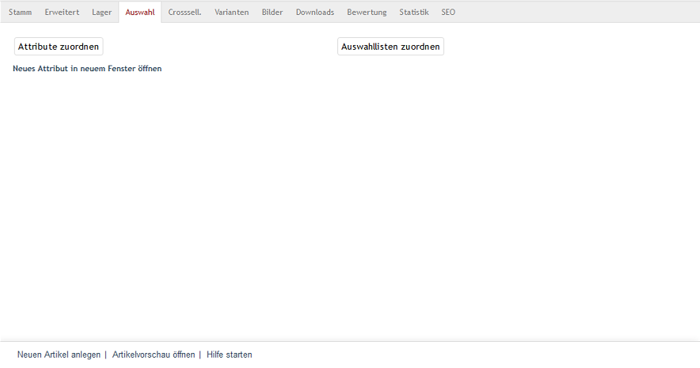
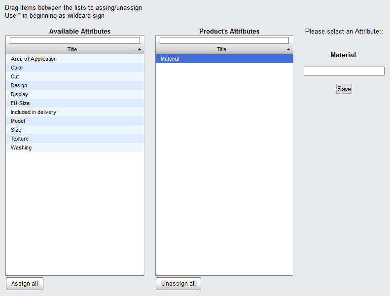
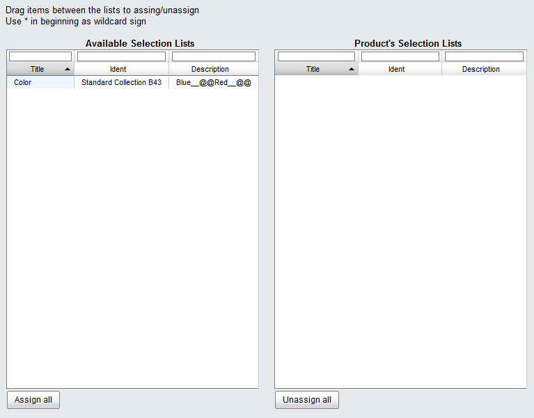

Selection tab
=============

Use the :guilabel:`Selection` tab to assign attributes and/or selection lists to a product.

OXID eShop provides built-in fields for standard characteristics such as weight or dimensions. Use these fields directly to define product properties. If you need additional characteristics, create custom attributes and assign them to your products.

Once attributes are assigned, the product details page displays a :guilabel:`SPECIFICATION` tab that lists the attributes and their values.

Use selection lists to define typical product variations, such as different colours or sizes. These act as templates that you can assign to many products. When you assign a selection list to a product, the product details page shows a dropdown menu. Customers select the desired variant, and the shop stores their choice—such as colour or size—with the order.

Click :guilabel:`Assign Attributes` to open a new assignment window. The left-hand list displays all unassigned attributes. Drag and drop the desired attributes into the right-hand list. Hold the Ctrl key to select multiple attributes.

Select an attribute in the right-hand list. Enter a value and click :guilabel:`Save`.

Click :guilabel:`Assign Selection Lists` to open another assignment window. Use drag and drop to move the required selection lists into the right-hand list.

.. seealso:: :doc:`Attributes <../attributes/attributes>` | :doc:`Selection Lists <../selection-lists/selection-lists>` | :doc:`Filtering Products <../products-and-categories/filtering-products>`

.. Intern: oxbacm, Status:, F1: article_attribute.html

