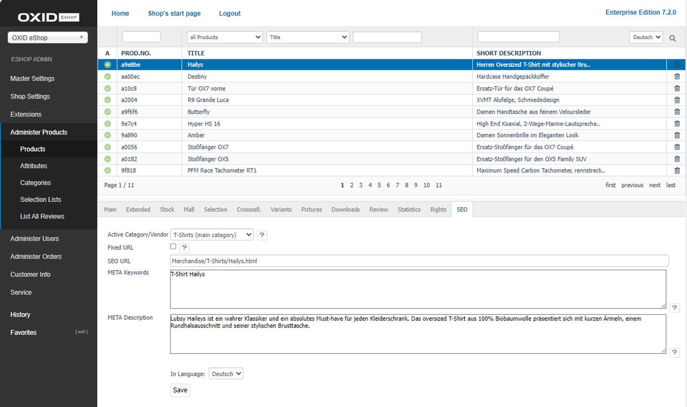

SEO tab
=================
The product’s :guilabel:`SEO` tab contains information and settings that are relevant to search engines.

The language selection list at the bottom of the input area allows you to edit product’s information and settings in another active language.

:guilabel:`Active Category/Vendor` |br|
Products can have different SEO URLs, depending on how they are called up: via a category, the brand (the manufacturer) or a keyword. Select which URL you want to view and customise.

:guilabel:`Fixed URL` |br|
If product’s data changes, e.g., the title or the category assignment, the SEO URL will be recalculated. Check the box to disable this feature for the selected URL. The existing SEO URL will remain unchanged.

:guilabel:`SEO URL` |br|
Displays the selected URL of the product which can also be changed and fixed.

:guilabel:`META Keywords` |br|
The keywords evaluated by search engines are integrated into the HTML source code (meta keywords). If you leave the field empty, they will be generated automatically, e.g., from the product’s title, the categories, and the search terms.

:guilabel:`META Description` |br|
This descriptive text is included in the HTML source code (meta description). It is displayed in the search results by many search engines. If you leave this field empty, the description will be automatically generated from the product’s long text.

:guilabel:`In Language` |br|
Select the desired language from the list for which you want to edit the SEO information and settings.

.. Intern: oxbacu, Status:, F1: article_seo.html