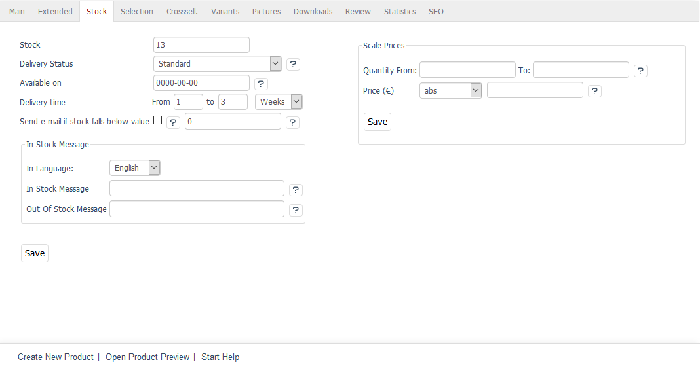

Stock tab
===================
OXID eShop has an integrated stock management system that shows the availability of products to customers and reduces stock with each order. The shop owner will be notified by email if the product’s stock falls below a specified number of items.

To use :doc:`Stock Management<../../configuration/stock-management>`, you will need to first activate and configure this feature in :menuselection:`Master Settings --> Core Settings`, the :guilabel:`Settings` tab, under :guilabel:`Stock`.

:guilabel:`Stock` |br|
When you create a product, you can enter its initial stock here. The stock decreases with each order. This field shows how many items are currently in stock and can also be adjusted if the stock changes.

The stock is illustrated by a small icon and a status message in the product’s detailed view.

* green icon: sufficient quantity of product in stock
* yellow icon: limited quantity of product in stock
* red icon: product out of stock

:guilabel:`Delivery Status` |br|
If a product is sold out, this can be displayed in different ways in the shop.

If :guilabel:`Standard` has been set as delivery status, the product can still be ordered even if it is sold out. However, it has to be reordered. If :guilabel:`External Storehouse` has been selected, the product can always be ordered since the actual stock can’t be checked. The product won’t be displayed as sold out. By selecting :guilabel:`If out of Stock offline` determine that the product is no longer displayed in the shop as soon as it is sold out. If you select :guilabel:`If out of Stock, not orderable`, the customers will see the product in the shop but won’t be able to order it. The :guilabel:`To cart` button won’t be displayed.

:guilabel:`Available on` |br|
Tell your customers when the product will be back in stock. The date must be specified in the YYYY-MM-DD format (year four digits, month and day two digits). It will be displayed together with the :guilabel:`Available on` note in the product’s detailed view.

:guilabel:`Delivery time From` ... :guilabel:`to` ... |br|
Here, you can specify the product’s delivery time. If both values are used, the delivery time in the product’s detailed view will be displayed as a time span, e.g. delivery time: 2 - 5 Days. Without the first value, the delivery time will be displayed in the fixed format, e.g. delivery time: 5 Days. The delivery time can also be specified in weeks or months.

:guilabel:`Send email if stock falls below the value` |br|
Check this box and enter the desired value if you would like to be notified by email if the stock falls below a certain value.

:guilabel:`In-Stock Message` |br|
You can specify which text is displayed if the product is in or out of stock. If no text is specified, a default message will be displayed. You will need to first activate this feature in :menuselection:`Master Settings --> Core Settings`, the :guilabel:`Settings` tab, under :guilabel:`Stock`.

:guilabel:`In-Stock Message` - :guilabel:`In Language` |br|
The messages can be defined for all active languages of the shop. Select the desired language from the list.

:guilabel:`In-Stock Message` |br|
Information about the product if it is in stock. Replaces the :guilabel:`Ready for shipping` default message.

:guilabel:`Out Of Stock Message` |br|
Information about the product if it is out of stock. Replaces the :guilabel:`This item is not on stock and has to be re-ordered` default message.

:guilabel:`Scale Prices` |br|
Scale prices are a discount that is granted when the customer purchases a certain quantity of products. The discount is assigned as an absolute price or as a percentage to a specific quantity range. Several quantity ranges form a scale with different product prices.

:guilabel:`Scale Prices` - :guilabel:`Quantity From:` ... :guilabel:`To:` ... |br|
Enter the product quantity for a quantity range.

.. hint:: Make sure that you enter a sufficient quantity in the :guilabel:`To:` field, e.g., 99999. If this number is too low, the original price will apply again if this quantity is exceeded.

:guilabel:`Scale Prices` - :guilabel:`Price (€)` |br|
Enter the product price for a unit of measure. This can be an absolute price or a price in percent.

.. seealso:: :doc:`Scale Prices <../products-and-categories/scale-prices>`

.. Intern: oxback, Status:, F1: article_stock.html