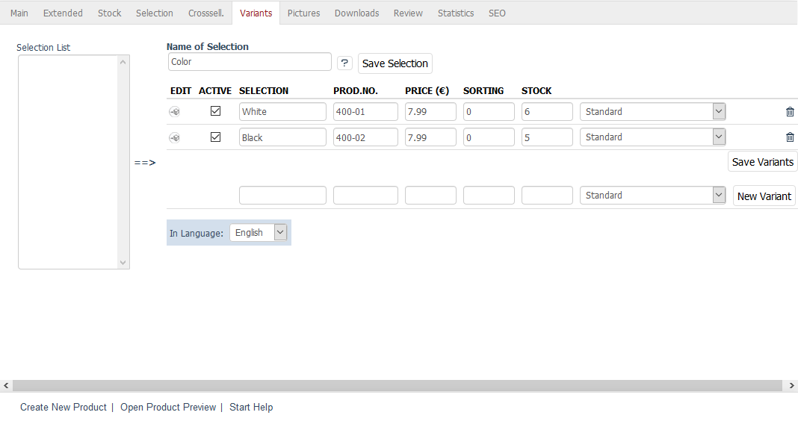
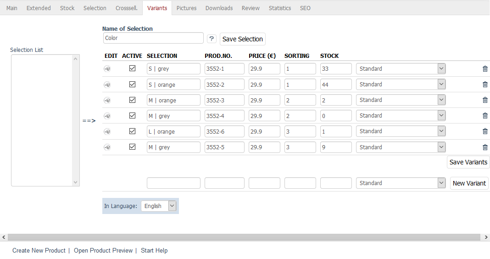

Variants tab
=======================
Variants allow you to use different versions of the same product. Typical versions include the different clothing sizes or multiple colours in which a product is offered.

The principle behind the variants is that first you need to create the so-called parent product. It contains all the basic information that will be inherited by the variants. The long description that you wrote for the parent product will be displayed for the variants unless a variant has a different long description. Variants can inherit the settings of the parent product or have different prices, separate product numbers, their own product images, different stocks, etc.

As a rule, the parent product is not available for purchase. This can be defined as a global setting in :menuselection:`Master Settings --> Core Settings`, the :guilabel:`System` tab, under :guilabel:`Variants`.

Product variants can be created in the :guilabel:`Variants` tab. Use the :guilabel:`Name of Selection` field to enter the term that characterises different variants, e.g. \"Size\", \"Material\" or \"Colour\". This term will be displayed as the name of the drop-down list that allows you to select the variants in the product’s detailed view.

Multidimensional variants provide a selection of multiple characteristics of a product. This way, the product’s detailed view will contain several drop-down lists to choose from, e.g. \"Size\" and \"Colour\". Multiple selection can be implemented by using special syntax rules in the :guilabel:`Name of Selection` and :guilabel:`Selection` fields. The vertical bar (|) separates the various characteristics and their values.

:guilabel:`Selection lists` |br|
Displays the existing selection lists that can be used to create variants with just one click of the mouse. If you have recurring versions of your products, you should create corresponding selection lists as a template. Now, you just need to highlight the selection list and press the arrow pointing to the right in the direction of the table. All variants will be created and can be further edited, activated and saved as needed. If several selection lists are assigned, this will result in multidimensional variants.

:guilabel:`Name of Selection` |br|
Enter a term that distinguishes the variants. This term will be displayed in the product’s detailed view as the name of the drop-down list for the variant selection. The visitors should be able to see at a glance what they can select from the list. The name of the selection will be saved separately.

Example of multidimensional variants: Size | Colour

Fill out the input fields in the table to create a variant. The variant must be then activated and saved. Click on :guilabel:`New Variant` to add another variant to the table.

:guilabel:`Edit` |br|
Clicking on the edit icon opens the variant in the product management section. The display is almost identical to that of a regular product. You can configure all the settings and store the information as usual. The only difference is that the first line, :guilabel:`Variant of` has been added to most tabs. The :guilabel:`Main` tab has an additional :guilabel:`Go to` drop-down list that can be used to display the parent product or other variant directly.

:guilabel:`Active` |br|
Check this box to activate the variant and have it displayed for selection in the product’s detailed view.

:guilabel:`Selection` |br|
An entry that can be selected in the drop-down list of the product’s detailed view. For example, if the variants have different colours, you will need to enter the colour here.

:guilabel:`Prod.No.` |br|
Variant’s product number. If empty, the product number of the parent product will be used.

:guilabel:`Price (€)` |br|
Variant’s price. If empty, the price of the parent product will be used.

:guilabel:`Sorting` |br|
Enter a number that determines the sorting of the entry in the drop-down list. The variant with the lowest sorting number will be displayed first in the selection.

:guilabel:`Stock` |br|
Variant’s stock. Use the list next to it to select the behaviour if the variant is out of stock. See :guilabel:`Delivery Status` in the :guilabel:`Stock` tab.

:guilabel:`In Language` |br|
Allows you to quickly edit variants in another active language of the shop.

.. seealso:: :doc:`Selection lists <../selection-lists/selection-lists>`

.. Intern: oxbaco, Status:, F1: article_variant.html