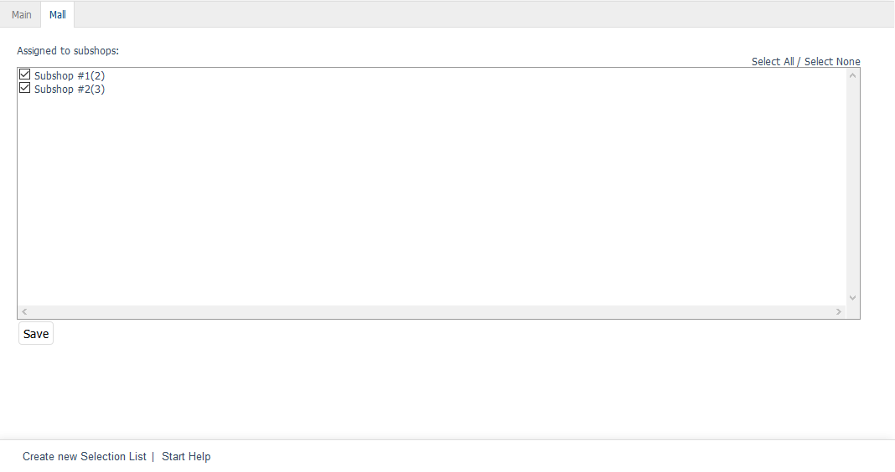

Mall tab
========

The :guilabel:`Mall` tab is only available for selection lists in OXID eShop Enterprise Edition.

Selection lists can be inherited when creating shops. If the option :guilabel:`Shop inherits all inheritable items (products, discounts etc) from it's parent shop` is selected, the new shop will also contain all the selection lists of the parent shop. The inherited selection lists can’t be changed and retain their original assignment to products.

The :guilabel:`Mall` tab can be used to manage assignments of selection lists to subshops and supershops. Multishops don’t inherit selection lists from other shops.

The inheritance of all selection lists for a shop can be undone. To do this, uncheck the inheritance settings box in the :guilabel:`Mall` tab of the subshop or supershop under :menuselection:`Master Settings --> Core Settings`.

:guilabel:`Assigned to following subshops`
   Check or uncheck the appropriate box to assign/unassign a selection list to/from subshops and supershops. If the box is not checked, the selection list will be available in the parent shop but not in the respective subshop or supershop.

Use the :guilabel:`Select All` and :guilabel:`Select None` links on the right side of the window to assign/unassign the selection list to/from all shops. Any changes made must be saved and will immediately be effective for subshops or supershops.

.. Intern: oxbagj, Status:, F1: selectlist_mall