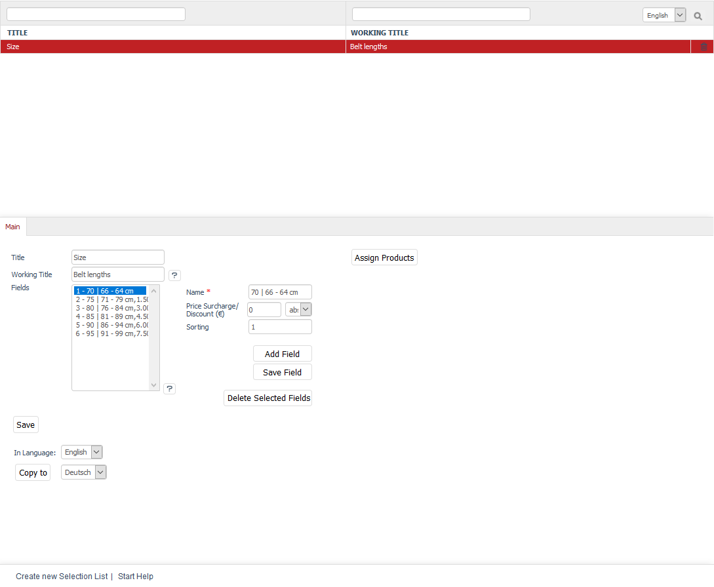

Selection lists
=============
Selection lists allow you to define typical product versions, such as a selection of colours, sizes or materials.

Selection lists can be assigned to products directly. The product’s details page will have a drop-down list where customers can select the desired version. The selected version will be taken into account when buying the product, saved when placing an order and emailed to the customer and the shop owner. Selection lists can also be used to create real variants. They serve as a template that can be used for creating all resulting product’s variants.

Selection lists will only be visible on the product’s details page if the :guilabel:`Load Selection Lists` box under :menuselection:`Master Settings --> Core Settings`, the :guilabel:`Perform.` tab has been checked. If you want a surcharge or discount to be taken into account when buying a product and calculated in the shopping cart, you will also need to check the :guilabel:`Support Price Modifications by Selection Lists` box. Check the :guilabel:`Load Selection Lists in Product Lists` box if you want to have the selection list displayed not only in the product’s detailed view. This setting allows you to display the product drop-down list in the category view or in search results.

Selection lists alone can only be used to represent different prices. A surcharge or discount (absolute or percentage) is what makes the individual versions different. If you need more flexibility, you should use variants. Variants allow you to modify everything that constitutes a product. Product variants can not only have different prices but also separate product numbers, different descriptions, their own product photos, different stocks, etc.

.. hint:: Make sure to use variants if you plan to connect your OXID eShop with an ERP (Enterprise Resource Planning) software or a merchandise management system later. Independent variants are always required for this purpose.

Selection lists can be edited in the Admin panel under :menuselection:`Administer Products --> Selection Lists`. You will see a list of selection lists and the respective input area below.

All created selection lists are displayed in alphabetical order. You can search for selection lists by using the search field and the magnifying glass icon. For example, if you type \"r\" in the search box, you will see the \"Colour\" and \"Material\" selection lists displayed in the list.

Selection lists can be permanently removed from the database by clicking on the trash icon at the end of the line.

When you select a selection list, its information will be displayed in the input area. To create a new selection list, click on :guilabel:`Create new Selection List` at the bottom of the screen.

-----------------------------------------------------------------------------------------

Main tab
-------------------
**Contents**: product’s selection list, field, product version, support price changes through selection lists, sorting selection lists, assigning products |br|
:doc:`Read article <main-tab>` |link|

Mall tab
------------------
Available only in Enterprise Edition |br|
**Contents**: inheriting selection lists, assigning selection lists, parent shop, subshop, supershop, multishop, Mall, Enterprise Edition |br|
:doc:`Read article <mall-tab>` |link|

.. seealso:: :doc:`Products <../products/products>` | :doc:`Products - Selection tab <../products/selection-tab>` | :doc:`Products - Variants tab <../products/variants-tab>`

.. Intern: oxbafi, Status: