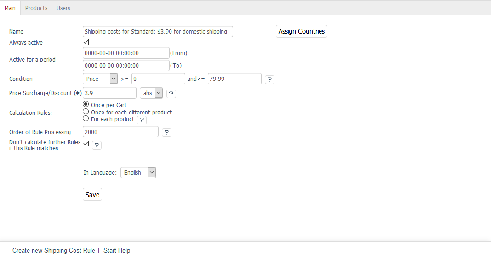

Main tab
===================

The :guilabel:`Main` tab of the shipping cost rules allows you to define terms and conditions for calculating the shipping costs. Countries are assigned to the shipping cost rule via a dialog. You will need to assign at least one country.

:guilabel:`Name` |br|
This input field contains the name of the shipping cost rule. The name can be freely defined but should be logically related to the shipping method for which the shipping cost rule is created. This facilitates the overview if the shipping representation requires a lot of shipping cost rules. For example, the word \"Standard\" in the shipping rules of OXID eShop indicates the underlying shipping method.

:guilabel:`Active` |br|
The shipping cost rule is active when the control box is checked.

:guilabel:`Or, active for period` ... :guilabel:`(from)` ... :guilabel:`(to)` |br|
Alternatively, you can set a shipping rule to apply only to a specified time period defined here. The input format should be YYY-MM-DD HH:MM:SS. Don’t check the :guilabel:`Active` box for the time period to be taken into account, and don’t forget to specify the “To” date.

:guilabel:`Condition \>=` ...\:guilabel:`and \<=` ... |br|
Shipping cost rules can be defined based on the amount, size, weight or price of the products ordered by using a small drop-down list. The condition must be formulated in such a way that it is valid. Make sure you always enter a “to” quantity, a “to” size, a “to” weight or a “to” price.

:guilabel:`Price Surcharge/Discount (€)` |br|
Enter the shipping costs in absolute or percentage terms by selecting \"abs\" or \"%\" in the small drop-down list. You can use the discount to display time or quantity-based discounts in connection with a time period or quantity as a condition.

:guilabel:`Calculation Rules` |br|
Shipping price can be calculated in three different ways.

:guilabel:`Once per Cart` |br|
Shipping price is calculated once per cart.

:guilabel:`Once for each different product` |br|
Shipping price is calculated once per different product. It doesn’t matter how many products were added to the shopping cart.

:guilabel:`For each product` |br|
Shipping price is calculated for each product in the shopping cart.

:guilabel:`Order of Rule Processing` |br|
Specify when the shipping cost rule should be applied. The shipping cost rule with the smallest number will be considered first in the calculation. The order of processing must be well thought out. You will need to think about which shipping cost rule has to be checked first and whether another shipping cost rule needs to be considered afterwards. All rules that check only one condition and that don’t work in combination with other rules should always be considered first.

:guilabel:`Don't calculate further Rules if this Rule matches` |br|
If the conditions of several shipping costs apply, the shipping costs will add up. If the shipping costs have already been adequately calculated by a shipping cost rule, further calculation can be prevented by checking this box.

:guilabel:`In Language` |br|
Shipping cost rules can be edited in other active languages of the shop. To do this, select the desired language from the drop-down list.

:guilabel:`Copy to` |br|
You will need to copy a shipping cost rule before it can be edited in another active language. To do this, select the language from the drop-down list and click on :guilabel:`Copy to`. This button won’t be displayed if there are no other active languages in the shop.

:guilabel:`Assign Countries` |br|
Ideally, the shipping cost rule should have countries assigned to it that match those in the associated payment and shipping method. This ensures transparent logic in the definition of payment and shipping. If no country has been assigned, the shipping cost rule will apply to all countries.

Click on :guilabel:`Assign Countries` and select countries from the :guilabel:`All Countries` list that opens in a new window. Countries can be sorted and filtered by title and/or country abbreviation (ISO Alpha 2). Drag the desired countries into the right-hand list using the mouse. Hold down the Ctrl key to select multiple countries. The assignment to the shipping cost rule is now completed.

.. hint:: Domestic and foreign shipping should always be controlled by shipping cost rules. Don’t use shipping methods as this could cause problems if the billing address and the shipping address are from different countries when placing an order.

.. seealso:: :doc:`Weight-dependent shipping costs <../payment-and-shipping/weight-based-shipping-costs>` | :doc:`Free shipping from certain product value <../payment-and-shipping/free-shipping-from-certain-product-value>` | :doc:`Domestic and foreign shipping costs <../payment-and-shipping/domestic-and-foreign-shipping-costs>`

.. Intern: oxbadk, Status:, F1: delivery_main.html