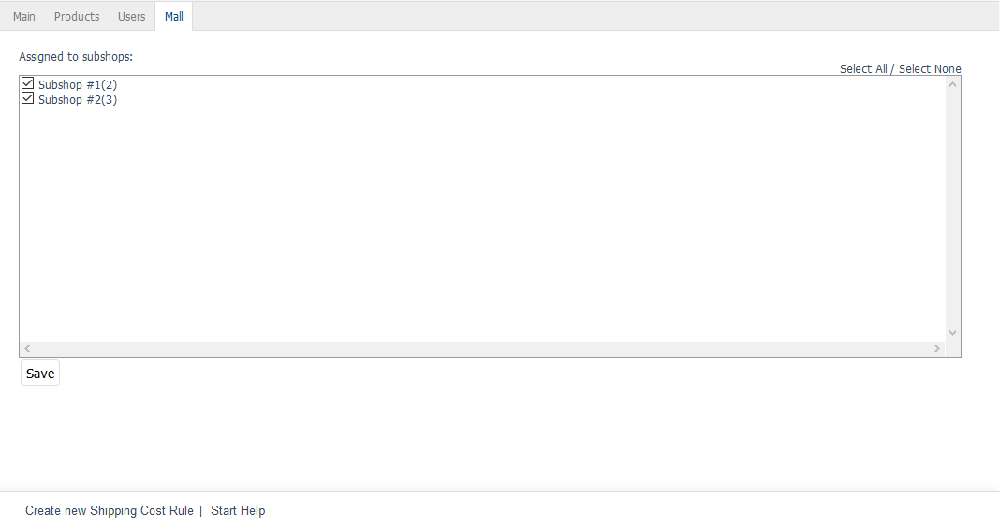

Mall tab
========

The :guilabel:`Mall` tab is only available for shipping cost rules in OXID eShop Enterprise Edition.

Shipping cost rules can be inherited when creating shops. If the option :guilabel:`Shop inherits all inheritable items (products, discounts etc) from it's parent shop` is selected, the new shop will also contain all the shipping cost rules of the parent shop. The inherited shipping cost rules can’t be changed and retain the original assignments to the countries, categories, products, user groups or users.

The :guilabel:`Mall` tab can be used to manage the assignments of shipping cost rules to subshops and supershops. Multishops don’t inherit shipping cost rules from other shops.

The inheritance of all shipping cost rules for a shop can be undone. To do this, uncheck the box :guilabel:`Inherit delivery information from parent shop` in the :guilabel:`Mall` tab of the subshop or supershop under :menuselection:`Master Settings --> Core Settings`. This will also remove the assignment to the inherited shipping methods.

:guilabel:`Assigned to following subshops` |br|
Check or uncheck the appropriate box to assign/unassign the shipping cost rule to/from subshops and supershops. If the box is not checked, the shipping cost rule will be available in the parent shop but not in the respective subshop or supershop.

Use the :guilabel:`Select All` and :guilabel:`Select None` links on the right side of the window to assign/unassign the shipping cost rule to/from all shops. Any changes made must be saved and will immediately be effective for subshops or supershops.

.. Intern: oxbadn, Status:, F1: delivery_mall.html