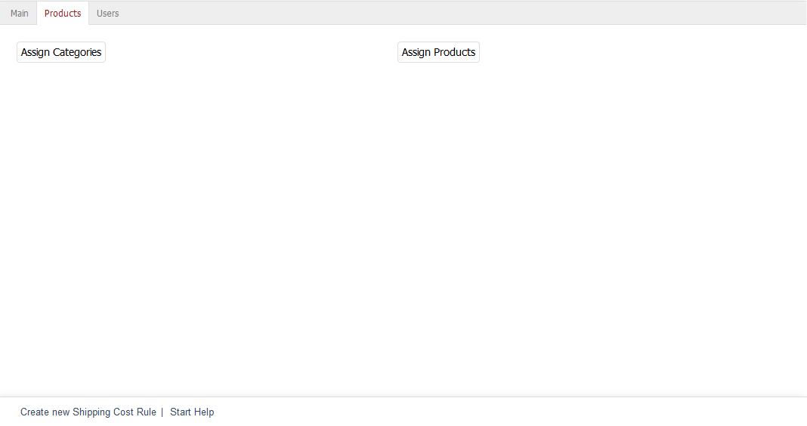

Products tab
=====================

Shipping cost rules can apply to categories and/or products. The :guilabel:`Products` tab allows you to configure the necessary assignments. Without assignment of categories and/or products, the shipping cost rule will apply to the entire product catalogue.

:guilabel:`Assign Categories` |br|
Clicking on this button will open the assignment window and display the two lists - :guilabel:`All Categories` and :guilabel:`Assigned Categories`. Categories can be filtered and sorted by title and short description. Drag the desired categories from the left-hand list into the right-hand list using the mouse. Hold down the Ctrl key to select multiple categories. The assignment is now completed.

:guilabel:`Assign Products` |br|
Click on :guilabel:`Assign Products` to define individual products for the shipping cost rule. The assignment window opens and displays the two lists :guilabel:`All Products` and :guilabel:`Assigned Products`. Select a category from the drop-down list if you only want to display products from this category. You can also filter and sort products by product number, title and/or EAN. Drag and drop the products into the right-hand list to assign them to the shipping cost rule. Hold down the Ctrl key to select multiple products.

.. seealso:: :doc:`Shipping costs for specific products <../payment-and-shipping/shipping-costs-for-specific-products>` | :doc:`Shipping costs for products from specific categories <../payment-and-shipping/shipping-costs-for-products-from-specific-categories>`

.. Intern: oxbadl, Status:, F1: delivery_articles.html