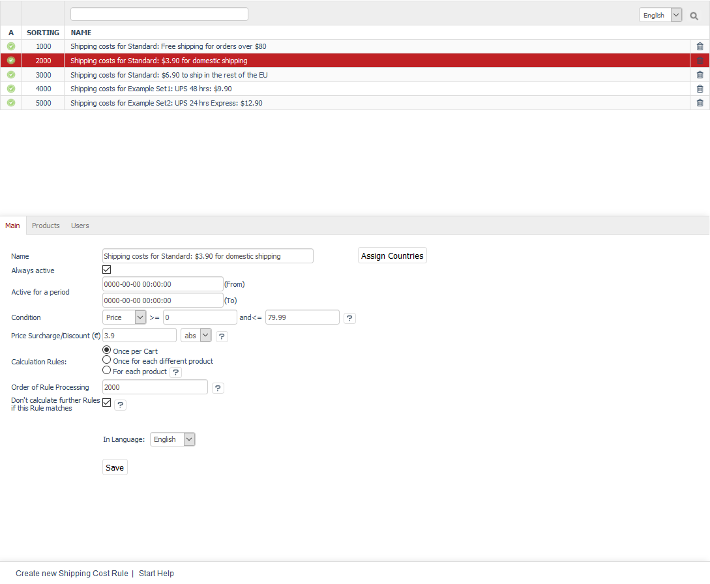

Shipping cost rules
===================

Shipping and payment are important functions in an online shop. They are determined by the definition of shipping cost rules and shipping and payment methods that are interrelated. While it is good to have as few shipping methods as you need, the shipping cost rules are the fine adjustment elements in the configuration of payment and shipping. They are used to determine the conditions for the delivery of the ordered products to the customer. They allow the calculation of surcharges for small quantities or set exemption limits for shipping costs. They also allow defining different shipping costs for different countries.

Shipping costs will be charged if customers have selected a shipping method in the third step of the ordering process. All shipping costs that are assigned to the shipping method will be checked for validity one after the other. This depends on whether certain purchase values, total weights, order quantities or sizes apply or not. The assigned countries, user groups, users, categories and products must also be correct. A shipping cost rule will be valid only once all conditions have been met. Shipping costs are calculated from all valid shipping cost rules. When there are several valid shipping cost rules, they are added up.

All required settings and assignments can be configured in the Admin panel under :menuselection:`Shop Settings --> Shipping Cost Rules`. This section contains a list of all shipping cost rules and their names. You can search for shipping cost rules by entering their names in the search field. Shipping cost rules can be permanently removed from the database by clicking on the trash icon at the end of the line.

The input area for shipping cost rules is located right below the list. When you select a shipping cost rule from the list, its information will be displayed in the input area. To create a new shipping cost rule, click on :guilabel:`Create new Shipping Cost Rule` at the bottom of the screen.

OXID eShop comes with the following shipping cost rules: \"Shipping costs for Standard: Free shipping for orders over $80\", \"Shipping costs for Standard: $3.90 for domestic shipping\" and \"Shipping costs for Standard: $6.90 to ship in the rest of the EU\". There are also two additional shipping cost rules as an example for standard and express shipping via UPS. Shipping cost rules can be used after being customised. They also serve as a template for newly defined shipping cost rules.

.. hint:: The assignment of countries is optional. In order for the definition of shipping and payment to be stringent, the assignment of countries should match the one in the relevant payment and shipping method. If no country has been assigned, the shipping cost rule will apply to all countries.

A valid condition must be formulated for the shipping cost rule. Make sure that the shipping cost rule is active.

-----------------------------------------------------------------------------------------

Main tab
-------------------
**Contents**: active shipping cost rule, active time period, condition for shipping cost rule, quantity, size, weight, price, shipping costs, surcharge, discount, absolute, percentage, time-based discount, quantity-based discount, calculation of shopping cart, order of shipping costs, order of calculation, stop calculation, no additional rules, assigning countries |br|
:doc:`Read article <main-tab>` |link|

Products tab
---------------------
**Contents**: assigning categories and products |br|
:doc:`Read article <products-tab>` |link|

Users tab
----------------------
**Contents**: assigning users and user groups |br|
:doc:`Read article <users-tab>` |link|

Mall tab
------------------
Available only in Enterprise Edition |br|
**Contents**: inheriting shipping cost rules, assigning shipping cost rules, parent shop, subshop, supershop, multishop, Mall, Enterprise Edition |br|
:doc:`Read article <mall-tab>` |link|

.. seealso:: :doc:`Payment methods <../payment-methods/payment-methods>` | :doc:`Shipping methods <../shipping-methods/shipping-methods>` | :doc:`Payment and shipping <../payment-and-shipping/payment-and-shipping>`

.. Intern: oxbadj, Status: