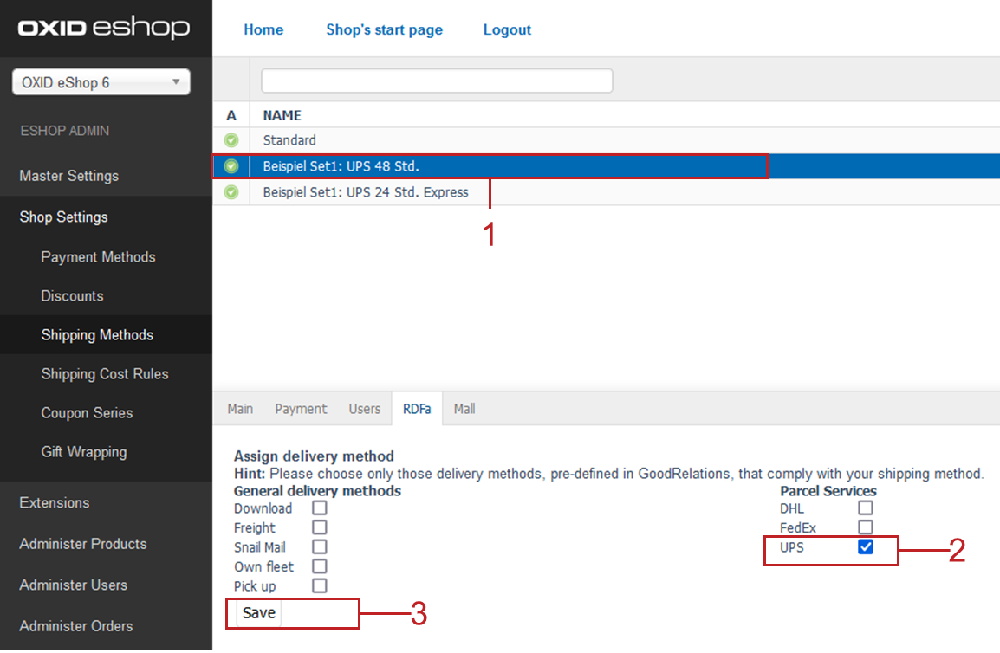

.. _rdfa-shipping-methods:

RDFa tab
========

Specify which RDFa data are to be embedded for each shipping method of your OXID eShop.

|background|

OXID eShop provides information well prepared for search engines, portals and other systems. This information can be presented, for example, as so-called Rich Snippets -- detailed information about a search result. The data is prepared on the basis of the Resource Description Framework (RDFa) and the GoodReleations description language optimized for e-commerce.

On the :guilabel:`RDFa` tab, a logical link is created between the payment type and the values predefined in GoodReleations for payment.

For more information on embedding RDFa data also of your :emphasis:`payment` methods, see :menuselection:`Shop Settings --> Payment Methods`, :ref:`RDFa tab <rdfa-payment-methods>`.

|prerequisites|

* For the store to use RDFa integration, you have enabled and configured the feature under :menuselection:`Master Settings --> Core Settings --> RDFa`.

|procedure|

On the :guilabel:`RDFa` tab, do the following for each shipping method you have configured:

1. Chooose the shipping method you want to embed in RDFa format (:ref:`oxbadi01`, item 1).
#. Mark the corresponding shipping method that GoodRelations offers for embedding (:ref:`oxbadi01`, item 2).
#. Save your settings (:ref:`oxbadi01`, item 3).

.. _oxbadi01:

   Fig.: Embedding shipping method information

.. Intern: oxbadi, Status:, F1: deliveryset_rdfa.html

