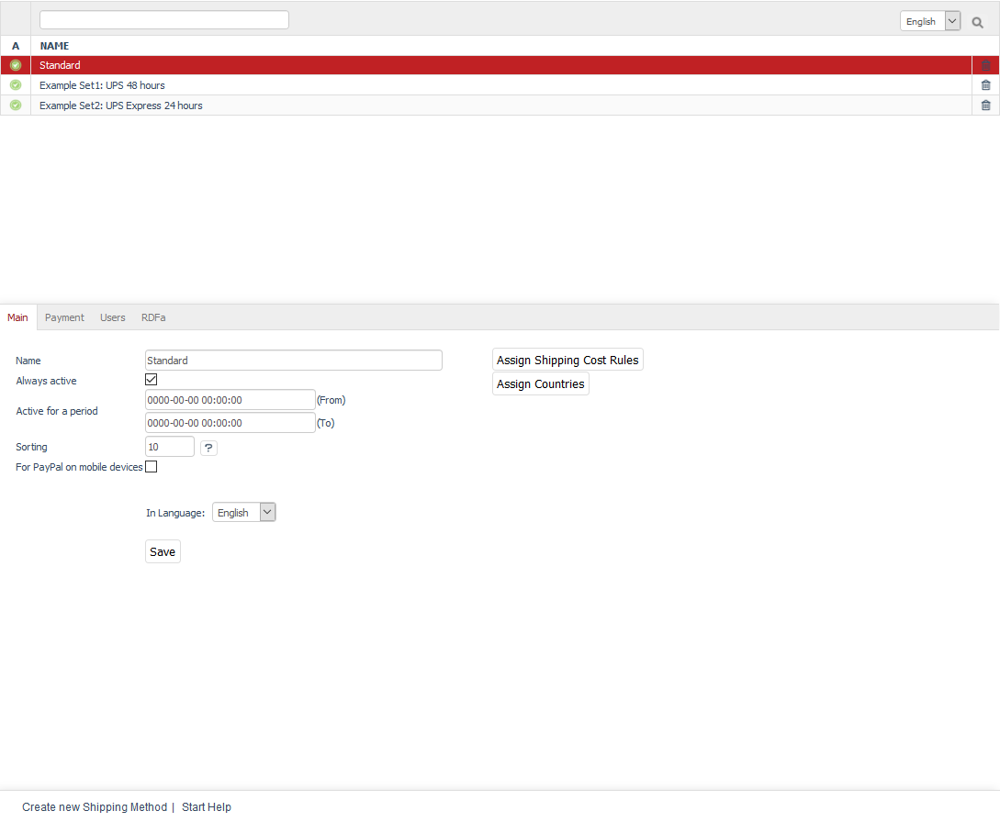

Shipping methods
============

Shipping and payment are important functions in an online shop. They are determined by the definition of shipping methods, shipping cost rules and payment methods that are interrelated.

Customers can choose how the ordered products should be shipped in the third step of the ordering process. Valid shipping methods are displayed in OXID eShop. If only one shipping method is valid, it will be selected automatically. Which shipping methods are offered depends on which country the customer orders from and which users or user groups are allowed to use this shipping method. At least one payment method and one shipping cost rule must have been assigned to the shipping methods.

All required settings and assignments can be configured in the Admin panel under :menuselection:`Shop Settings --> Shipping Methods`. This section contains a list of all shipping methods and their names. You can search for shipping methods by entering their names in the search field. Shipping methods can be permanently removed from the database by clicking on the trash icon at the end of the line.

The input area for shipping methods is located right below the list. When you select a shipping method from the list, its information will be displayed in the input area. To create a new shipping method, click on :guilabel:`Create new Shipping Method` at the bottom of the screen.

OXID eShop comes with the following shipping methods: \"Standard\", \"Example Set1: UPS 48 hours\" and \"Example Set2: UPS Express 24 hours\". These can be used after being customised, or as a template for newly defined shipping methods.

.. hint:: When setting up the shipping method, make sure that you have assigned at least one shipping cost rule and at least one payment method. Countries should also be assigned to ensure that the definition of shipping and payment is stringent. Without the country assignment, the logic of payment and shipping in the ordering process may be lost. If no country has been assigned, the shipping method will apply to all countries.

The assignment of users and user groups is optional. If no user or user group has been assigned, the shipping method will apply to all users. A shipping method will be valid and displayed in the ordering process only once all conditions have been met. Make sure that the shipping method is active.

-----------------------------------------------------------------------------------------

Main tab
-------------------
**Contents**: active shipping method, active time period, sorting, assigning shipping cost rules and countries |br|
:doc:`Read article <main-tab` |link|

Payment tab
---------------------------
**Contents**: assigning payment methods |br|
:doc:`Read article <payment-tab>` |link|

Users tab
----------------------
**Contents**: assigning users and user groups |br|
:doc:`Read article <users-tab>` |link|

Mall tab
------------------
Available only in Enterprise Edition |br|
**Contents**: inheriting payment methods, assigning payment methods, parent shop, subshop, supershop, multishop, Mall, Enterprise Edition |br|
:doc:`Read article <mall-tab>` |link|

RDFa tab
------------------
**Contents**: RDFa, Resource Description Framework, GoodRelations, e-commerce vocabulary, general shipping methods and parcel services, rich snippets |br|
:doc:`Read article <rdfa-tab>` |link|

.. seealso:: :doc:`Payment methods <../payment-methods/payment-methods>` | :doc:`Shipping cost rules <../shipping-cost-rules/shipping-cost-rules>` | :doc:`Payment and shipping <../payment-and-shipping/payment-and-shipping>`

.. Intern: oxbadd, Status: