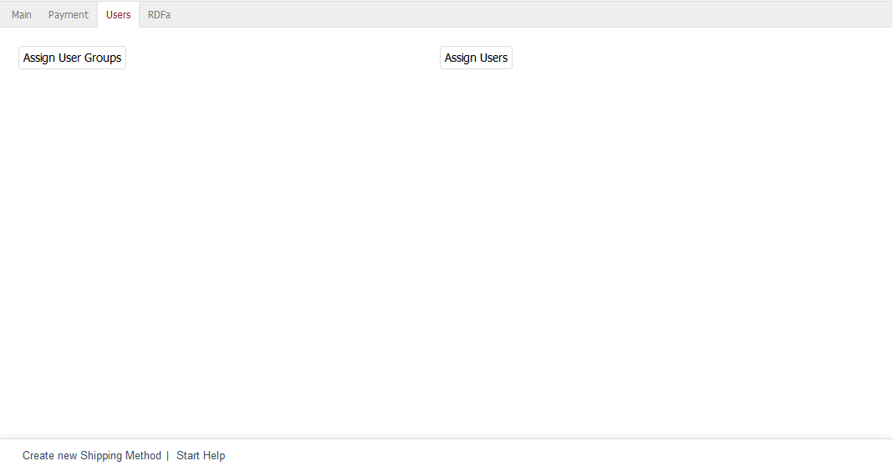

Users tab
=========

Shipping methods can be configured to apply to specific user groups and/or users. Go to the :guilabel:`User` tab to complete the assignment.

If no user group has been assigned, the shipping method will apply to all user groups. Shipping methods can also apply only to individual users. However, this type of assignment means that only selected users will be able to use this shipping method. This makes the assigned user groups obsolete.

:guilabel:`Assign User Groups`
   Clicking on this button opens the assignment window and displays the two lists :guilabel:`All User Groups` and :guilabel:`Assigned User Groups`. User groups can be filtered and sorted by title. Drag the desired user groups from the left-hand list into the right-hand list using the mouse. Hold down the Ctrl key to select multiple user groups. The assignment is now completed.

:guilabel:`Assign Users`
   Click on :guilabel:`Assign Users` to define individual users for the shipping method. The assignment window opens and displays the two lists :guilabel:`All Users` and :guilabel:`Assigned Users`. Select a user group from the drop-down list in the left-hand list of the assignment window to only display users from this group. Users in both lists can be filtered and/or sorted by login (user e-mail).

   You can also select multiple users. Drag and drop the desired users into the right-hand list The assignment is now completed.

.. Intern: oxbadg, Status:, F1: deliveryset_users.html